<h1 align="center">MyWork Kit</h1>

<p align="center"><b>A personal-workbench bundle for DeepSeek Harness: dsh itself untouched, everything is a plugin.</b></p>
<p align="center">Web research, spreadsheets and slides, scheduled tasks and reminders, a WeChat / Feishu assistant, all in one dsh profile, with no iframes anywhere.</p>

<p align="center"><a href="README.md">中文</a> · English · <a href="https://zhuanlan.zhihu.com/p/2086048468519466606">Article on Zhihu (Chinese)</a></p>

<p align="center">
  <a href="https://github.com/William2333ZZ/mywork-deepseekharness/releases"></a>
  <a href="https://github.com/deepseek-ai/deepseek-harness"></a>
  
  <a href="LICENSE"></a>
  <a href="https://github.com/William2333ZZ/mywork-deepseekharness/stargazers"></a>
</p>

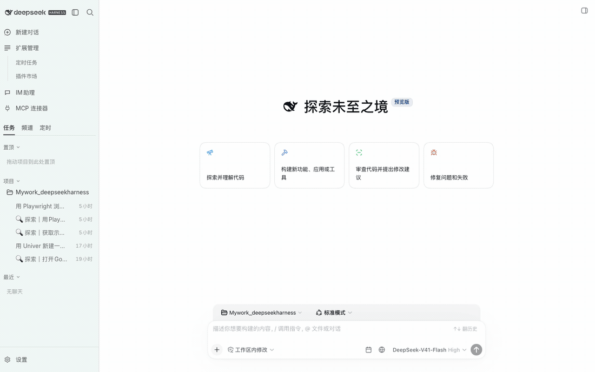

> The UI follows dsh's language setting (Chinese / English). The screenshots below were taken in Chinese.

## Download

| Option | For whom | How | Status |
| --- | --- | --- | --- |
| **Desktop, Windows x64** (portable zip) | People who don't want to install Node / dsh | Get `Mywork-DSH_desktop-win-x64.zip` from [Releases](https://github.com/William2333ZZ/mywork-deepseekharness/releases) → unzip → double-click `Mywork-DSH_desktop.exe` | Preview: unsigned (SmartScreen once), cross-built on a Mac, feedback welcome |
| **Desktop, macOS arm64** (.dmg) | Apple-silicon Macs | Get `Mywork-DSH_desktop-mac-arm64.dmg` from [Releases](https://github.com/William2333ZZ/mywork-deepseekharness/releases) → drag to Applications → right-click → Open the first time | Preview: unsigned (Gatekeeper once) |
| **One-command trial** | Machines with Node ≥ 24 | `git clone … && bash scripts/dev-env.sh`, never touches `~/.dsh` | Stable |
| **Install into your own dsh** | Existing dsh users | `bash scripts/install.sh web && dsh web` | Stable |

The desktop build bundles Node 24, dsh, Chrome for Testing and a profile with every plugin installed. Personal data (API key, IM logins, bookmarks, history, browser logins) lives in the data directory and survives upgrades and reinstalls.

## Ready on first launch

- **Stock dsh chat**: models, workspaces, sessions, files, terminal and Git are all dsh's own. The kit only adds things around them.
- **Codex-style sidebar and settings**: New conversation, Extensions (scheduled tasks / plugin market), IM assistant, MCP connectors. Only installed features are shown.
- **Live browser**: a real Chrome running in the background. Pages the model opens appear in the right pane in real time; you can click, scroll and type. The address bar behaves like Chrome's, the page fills the pane at any size, and every session can use it.
- **Spreadsheets and slides**: Univer builds them in a live window while you watch; review, then export `.xlsx` / `.pptx`.
- **Scheduled tasks and reminders**: tasks run on a schedule in their own sessions, and each task picks the chat its result is sent to. Reminders pop up on time with a notification and a sound, and can also go to IM.
- **WeChat / Feishu assistant**: WeChat, Feishu, DingTalk, WeCom, QQ and Telegram connect to your local dsh. Hand out tasks from a chat, or push messages from the desktop into a chat.
- **MCP connectors**: add / edit / disable MCP servers inside the app, import by pasting `mcpServers` JSON, mounted as soon as you save.
- **Four styles × light / dark × zoom**: Claude Code / Soft premium / Editorial minimal / Industrial brutalist, light / dark / follow system, UI zoom 80–150%.
- **Plugin market and Mermaid**: 2300+ community plugins one click away; mermaid code blocks in replies render as diagrams.

## Screens

### New conversation: four starting points

Web research / spreadsheets and slides / scheduled tasks and reminders / WeChat · Feishu assistant. Each opens as a prompt you can send right away; you only fill in the specifics.

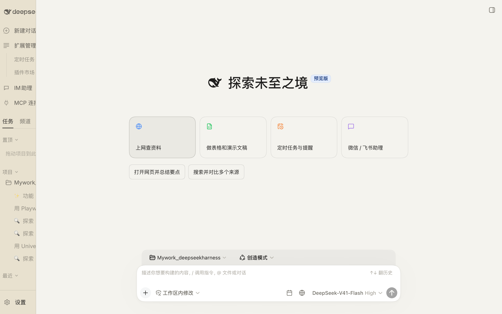

### Sidebar and settings

Navigation is trimmed to what's installed: Extensions holds only Scheduled tasks and Plugin market; Settings has a single MyWork entry with Members / Appearance / Schedule / Browser tabs, and missing members install with one click.

| | |
| --- | --- |
| 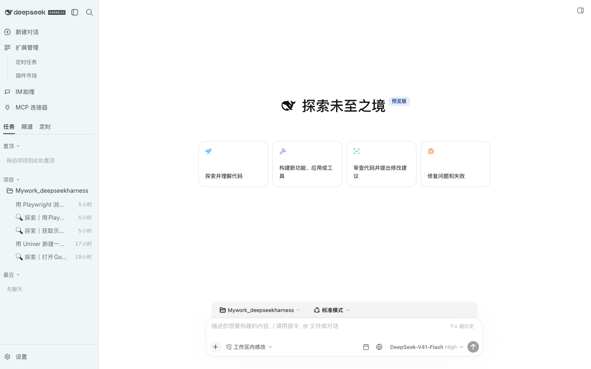 | 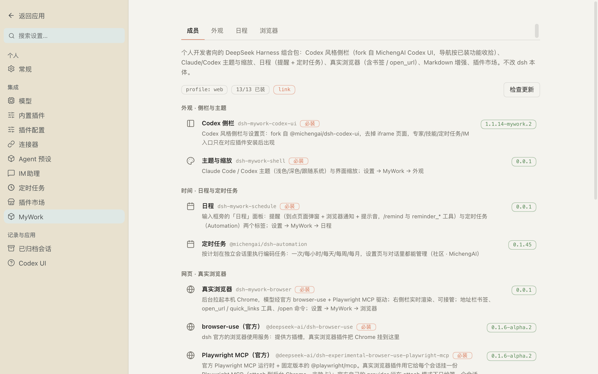 |

### Live browser

The right pane opens as soon as the model navigates. Type a URL to open it, or plain text to search (Bing / Google / Baidu / DuckDuckGo), with history and bookmark suggestions, inline completion, ↑↓ / Enter / Esc, and Ctrl/Cmd+L from inside the page to jump back to the address bar. The page viewport follows the pane size, so there are no black bars.

| | |
| --- | --- |
| 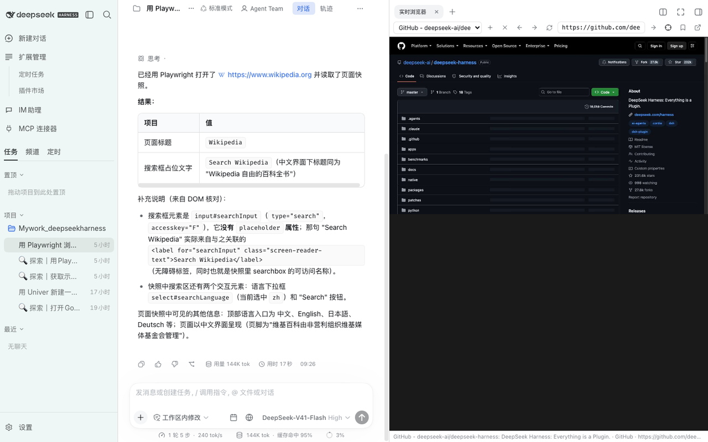 | 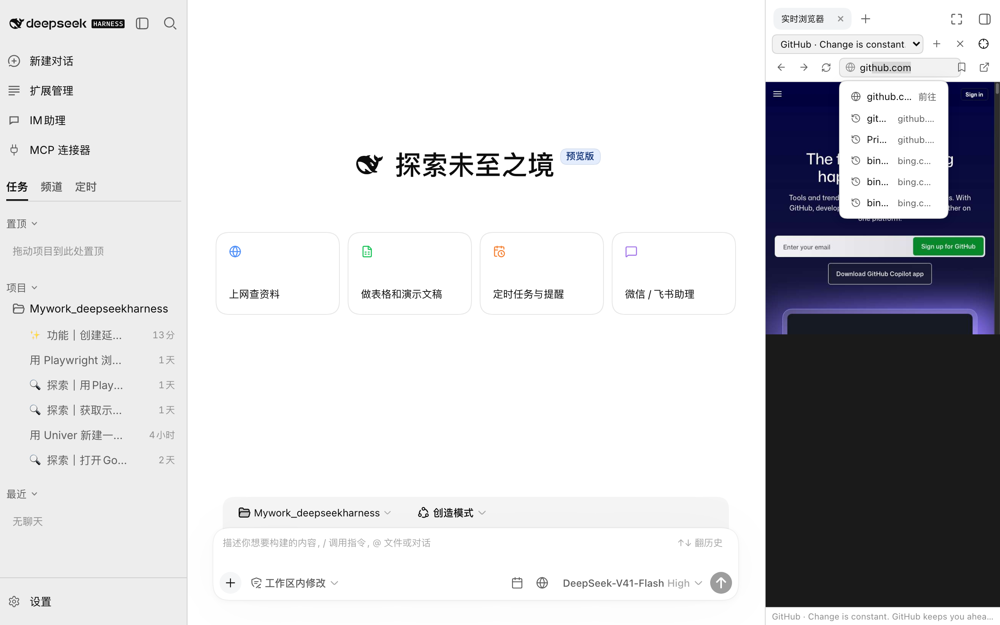 |

### Scheduled tasks

A standalone page (from Automation). The create / edit dialog gains a "Send to IM when done" row: pick a chat and choose every run / failures only. It is saved with the task and shown on its card.

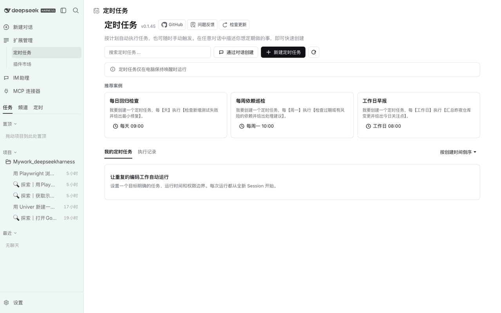

### Spreadsheets and slides

Univer works in a draggable live window and checks its own output as it goes. When done, a review card stays in the conversation: full screen, version comparison, export.

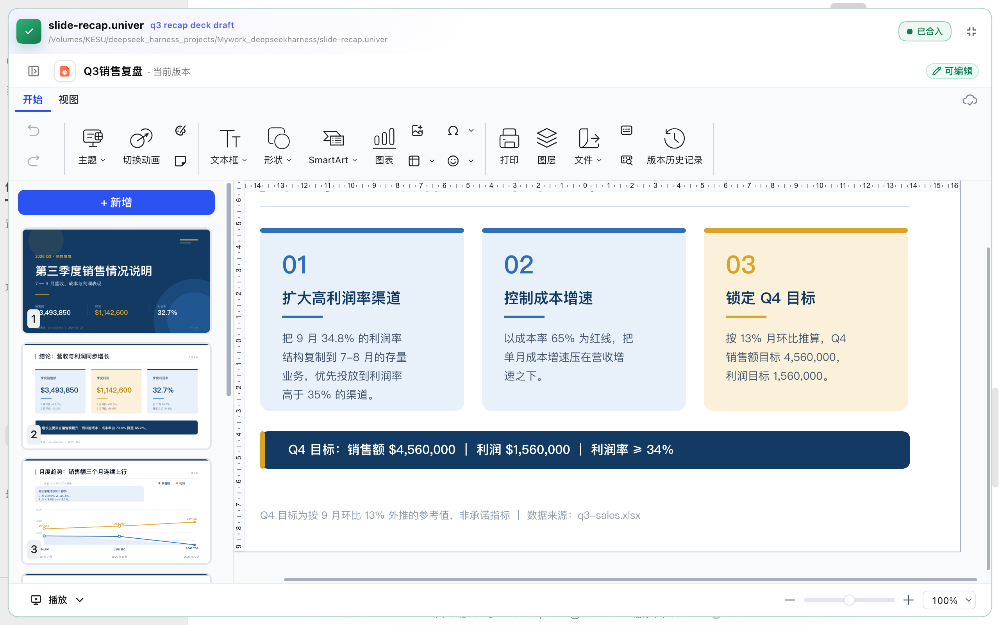

### IM assistant and MCP connectors

| | |
| --- | --- |
| 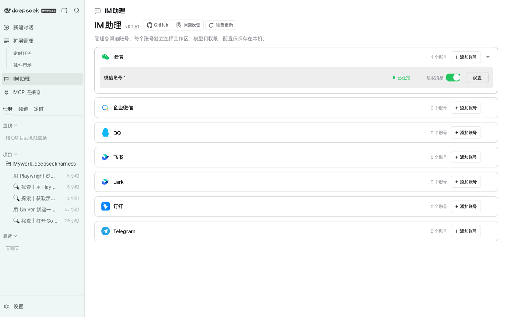 | 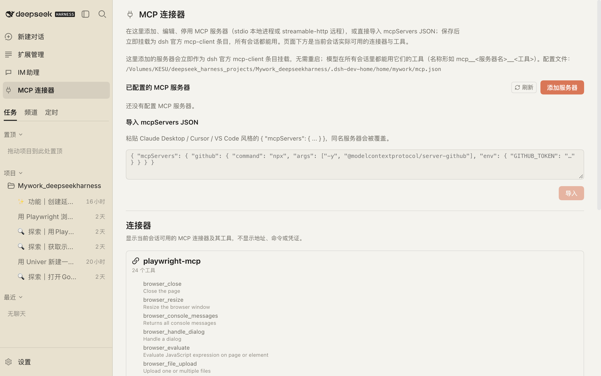 |

### Appearance and zoom

Besides Claude Code, the three styles come from the [taste-skill](https://github.com/Leonxlnx/taste-skill) pack: Soft premium (soft-skill: Plus Jakarta Sans, ultra-diffuse ambient shadows, pill buttons), Editorial minimal (minimalist-skill: warm bone canvas, 1px dividers, Newsreader serif headline) and Industrial brutalist (brutalist-skill: 90° corners, Archivo black, uppercase monospace metadata, one hazard red; dark mode is a CRT terminal with scanlines). Every text role in all four styles meets WCAG AA 4.5:1.

| Soft premium (light) | Industrial brutalist (dark) |
| --- | --- |
| 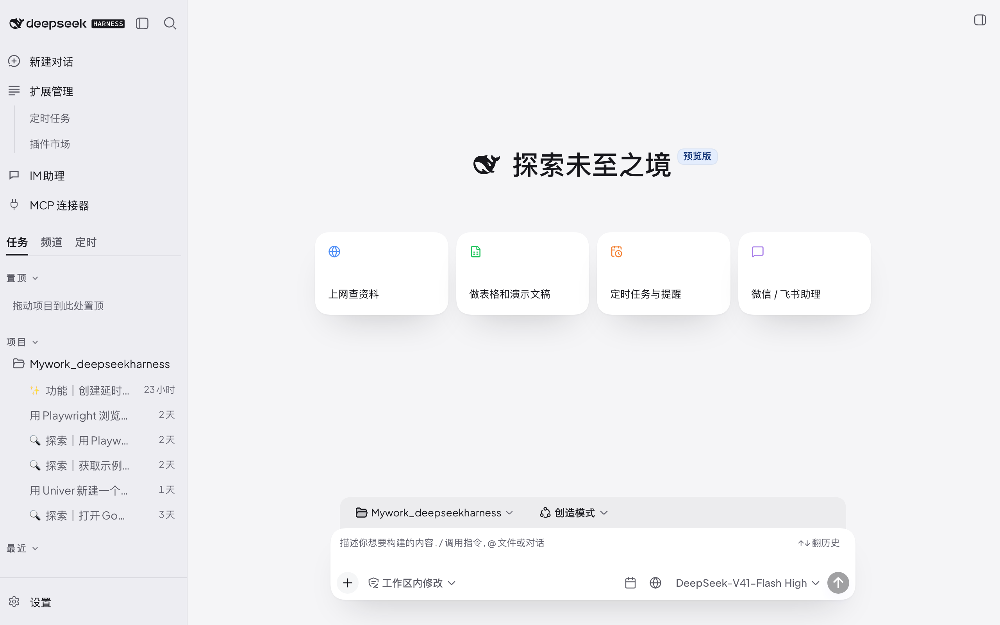 | 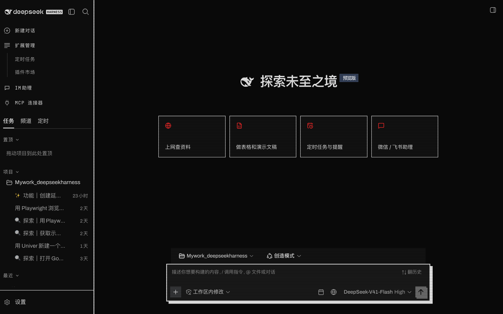 |

## Demo cases

Every case below has been run end to end with this kit. Paste the prompts as they are, or click the matching starting point on the New conversation page and it fills the prompt in for you. The prompts are shown in English here; Chinese works just as well.

### 1. Research on the web, summarizing as you watch

1. Click the globe icon next to the composer to open the Live browser pane, type `github.com` in the address bar (or a question, which goes to Bing) and press Enter.
2. Tell the model: **Open this URL for me and condense the page into 5 key points: https://github.com/deepseek-ai/deepseek-harness**
3. The model opens the page with Playwright, the pane follows along live, and you can click, scroll or type at any moment. The summary lands in the conversation.

### 2. Build a slide deck (or a spreadsheet)

Tell the model: **Make a slide deck from the material below, 5 slides at most, one point per slide, and screenshot it for me when done:** (paste the material after it). Same for spreadsheets: **Create a spreadsheet with Univer: headers, sample rows and summary formulas, then export .xlsx. The content is: …**

### 3. A scheduled task that reports to WeChat

1. Sidebar → Extensions → Scheduled tasks → New task. At the bottom, "Send to IM when done", pick a chat and save.
2. Or just say: **Create a scheduled task: every day at 09:00 check whether the GitHub repos I follow have new releases, and send the result to WeChat.** The model calls `automation_create` and `automation_notify_set`.
3. When the time comes the task runs in its own session, and its final reply is sent to the chat you chose, with the task name and Done / Failed.

> A personal WeChat bot can only reply within a window after you last messaged it (a platform limit, see Known issues). For on-time pushes, choose a Feishu / DingTalk / WeCom account as the target.

### 4. Use the assistant straight from WeChat

1. Sidebar → IM assistant → add a WeChat account (scan the QR code); Feishu / DingTalk / WeCom / QQ / Telegram take bot credentials.
2. Talking to the bot in WeChat is talking to a session of your local dsh: **Every day at 9, list the files in ~/Downloads older than 30 days and send them to me** becomes a scheduled task on the spot.
3. Push from the desktop: the "Send to a channel" card at the top of the IM assistant page, or tell the model **Boil the conclusion above down to 3 sentences and send it to WeChat**, or `/imsend text`. Tick "also send to IM" when creating a reminder.

### 5. Switch styles, zoom the UI

Settings → MyWork → Appearance: four styles × light / dark / follow system. Sidebar, settings, bubbles, composer and buttons all follow. UI zoom 80–150%; every popover, drag, Univer window and the live browser stay aligned with the mouse at any zoom.

## Everyday operations

- **Theme / zoom**: Settings → MyWork → Appearance. Message font size is dsh's own setting under Settings → General → Font size (12–17 px).
- **Reminders**: the calendar icon right of the composer → Reminders → Add; or tell the model "remind me to check CI in 10 minutes"; or `/remind 10m water`, `/remind 18:30 leave`, `/remind daily 09:00 standup`, `/remind weekly 1,3,5 10:00 weekly`, `/remind every 30m stand up`, `/remind list`. On time you get a page popup + browser notification (grant it once under Settings → MyWork → Schedule) + a sound. **The dsh page must stay open.**
- **In-session reminders** (dsh's own, enabled by the kit): tell the model "remind me in 30 minutes" and it comes back as a follow-up in the same session.
- **IM assistant**: add accounts under the "IM assistant" sidebar entry; their sessions show up under the "Channels" tab. With several accounts / chats, a send must name its target; nothing is guessed.
- **Push to IM**: the send card on the IM assistant page, "send the result to WeChat" in a conversation (`im_send`), or `/imsend text`. Only chats that have already talked to the bot can be reached, and delivery goes through one model turn.
- **Scheduled tasks**: Sidebar → Extensions → Scheduled tasks; the schedule panel and the sidebar "Scheduled" list jump there too; or describe it in a conversation ("run the tests every day at 9 and report").
- **MCP connectors**: the "MCP connectors" sidebar entry: a stdio command or a streamable-http URL, env vars / headers, or paste `mcpServers` JSON. The bottom of the page lists the connectors and tools actually available to the current session.
- **Open a web page**: the bookmark button in the address bar (Alt/⌥-click = system browser); `/open https://…` or `/open <bookmark name>`; the model uses `open_url`. Bookmarks and search engines live under Settings → MyWork → Browser.
- **Mermaid**: ```mermaid code blocks in replies turn into diagrams.

## Getting started

Prerequisites: Node ≥ 24 (see Known issues), pnpm, `dsh` on PATH. **Install the latest dsh**: `npm i -g @deepseek-ai/dsh@alpha` (currently 0.1.6-alpha.2; the `latest` tag is still 0.1.5-rc.2).

### One-command trial (never touches `~/.dsh`)

```bash
git clone https://github.com/William2333ZZ/mywork-deepseekharness.git && cd mywork-deepseekharness
bash scripts/dev-env.sh           # installs dsh@alpha + every plugin into .dsh-dev-home/ inside the repo and starts the web server (:3090)
bash scripts/dev-env.sh restart   # rebuild and restart after changing plugin code
bash scripts/dev-env.sh stop
```

Open the tokenized URL the command prints. Enter the API key under Settings → Models, or `export DEEPSEEK_API_KEY=…` before running. On Node older than 24 the script switches to Homebrew's `node@24` by itself.

### Install into your own dsh

```bash
npm i -g @deepseek-ai/dsh@alpha pnpm
bash scripts/install.sh web       # builds the local plugins, links them into the web profile and installs the community members
dsh web
```

Then open Settings → MyWork; if members are missing, click "Install the N missing" and restart dsh. The built `lib/` of every package is committed, so anyone who clones the repo runs the same commands. Uninstall with `bash scripts/uninstall.sh web`, or one by one with `dsh plugin --profile web remove <name>`.

## Bundled plugins

Packages in this repo (each can be removed on its own with `dsh plugin --profile web remove`):

| Package | Role |
| --- | --- |
| `dsh-mywork-kit` | The bundle itself: member list `kit.json`, the MyWork settings entry (the Members / Appearance / Schedule / Browser tabs are contributed by members through the `mywork.settings.tab` slot), the `mywork_kit_status` tool, automatic removal of retired members |
| `dsh-mywork-codex-ui` | Codex-style sidebar and settings pages, forked from [@michengai/dsh-codex-ui](https://github.com/MichengAI/dsh-codex-ui) (Apache-2.0): navigation trimmed to installed features, Scheduled tasks / IM assistant / MCP connectors as standalone main-area pages, upstream iframe pages removed |
| `dsh-mywork-shell` | Theme overlay (Claude Code / Soft premium / Editorial minimal / Industrial brutalist) and UI zoom |
| `dsh-mywork-schedule` | Reminders (`/remind`, `reminder_*` tools, schedule panel) and the IM notification setting for scheduled tasks (injected into Automation's task dialog) |
| `dsh-mywork-browser` | Real browser: launches local Chrome in the background, driven by the official browser-use + Playwright MCP, live view in the right pane, Chrome-style address bar, bookmarks, `open_url` / `/open` |
| `dsh-mywork-im` | Pushing messages to IM: `im_send` / `im_chats` / `automation_notify_set` tools, `/imsend`, scheduled-task completion notices |
| `dsh-mywork-mcp` | MCP connectors page: records, import, mounted dynamically as official mcp-client entries through the dsh loader |

Community members (mature npm packages, installed with one click from the kit panel, removable individually):

| Member | Role |
| --- | --- |
| [`@michengai/dsh-automation`](https://github.com/MichengAI/dsh-automation) | Scheduled tasks: runs tasks in their own sessions on a schedule (once / hourly / daily / weekly / monthly) |
| [`@michengai/dsh-im-connect`](https://github.com/MichengAI/dsh-im-connect) | IM assistant: DingTalk / Feishu / Lark / WeChat / WeCom / QQ / Telegram connected to local dsh |
| [`dsh-univer-office`](https://github.com/dream-num/dsh-univer-office) | Univer office: spreadsheets, documents, slides, live preview and review; needs a local Chrome |
| [`dshmarket`](https://github.com/dsh-market/dsh-market) | Plugin market: 2300+ community plugins, one-click install |
| [`dsh-mermaid-render`](https://github.com/baosfeng/my-dsh-plugins/tree/main/plugins/dsh-mermaid-render) | Renders mermaid code blocks as diagrams, works offline |
| `@deepseek-ai/dsh-browser-use` + `dsh-experimental-browser-use-playwright-mcp` | The official browser-use runtime, the foundation of the live browser |

## Why this approach

- **A bundle = `dsh.bundle` + `cordis.patch.yml`.** dsh only activates bundle layers that the profile depends on directly, so members are not listed in `dependencies`; they are installed into the profile as first-class citizens (the panel's "Install" runs `pnpm add` in the profile directory and writes `dsh.profile.bundles` back, the same reconciliation `dsh plugin add` does). Any member can be removed on its own or managed by the plugin market.
- **Host plugins have zero dependencies.** A third-party plugin importing `@deepseek-ai/dsh-tools` cannot resolve it under a `link:` install, so the host code registers plain JSON Schema tools and validates its config by hand (`src/harness.js`). npm / tarball / git / link installs all load.
- **The browser half is a C6 bundle**: `scripts/build-client.mjs` wraps the plain CommonJS `src/client/index.js` into `window.__ModuleLoader__.load({ id, factory })`, `react` comes from dsh, no build dependencies.
- **Themes are an overlay on the official `ctx.theme.overrideTokens`**, and light / dark is still stored by dsh. A style overrides dsh's specific / business tokens as well as the fork's sidebar variables, otherwise switching is invisible.
- **Zoom applies to the app root, not `<html>`**: dsh's popovers are positioned in viewport coordinates, so zooming the whole document shifts them. Root zoom plus inverse zoom on JS-positioned fixed elements keeps everything aligned, and the Univer window stays at 1:1.
- **No iframes.** Live browser, MCP configuration and settings pages are all native pages; `dsh-mywork-browser` disables dsh's built-in iframe browser row.
- **Every HTTP route goes through the host's `connection.requestRejection` auth** (same origin / token), and the install endpoints are additionally limited to loopback.

## Desktop build

`apps/desktop/` packs dsh plus every plugin into a self-contained desktop app: an Electron window shell + bundled Node 24 + bundled dsh + bundled Chrome for Testing + a pre-installed profile. dsh runs as a child process and the window only loads its URL.

```bash
node apps/desktop/build.mjs win-x64     # → apps/desktop/dist/Mywork-DSH_desktop-win-x64.zip
node apps/desktop/build.mjs mac-arm64 && bash apps/desktop/package-mac.sh   # → .dmg
```

The Windows package is cross-built on a Mac (npm `--os/--cpu` + pnpm `supportedArchitectures`). Unsigned; installing plugins / members from inside the app needs pnpm on the machine. See [apps/desktop/README.md](apps/desktop/README.md).

## Data and permissions

- All personal data lives under `$DSH_HOME` (desktop: Windows `%APPDATA%\Mywork-DSH_desktop\home`, macOS `~/Library/Application Support/Mywork-DSH_desktop/home`). The kit's own files are in `$DSH_HOME/mywork/`: reminders `reminders.json`, bookmarks `links.json`, address-bar history `browser-history.json`, MCP records `mcp.json`, IM notification rules `im-notify.json`, Chrome login state `chrome-profile/`.
- The API key, dsh login (`.credentials.yaml`) and IM account logins (`dsh-im-connect/`) are in the same directory and survive restarts and upgrades. To move machines, copy the directory (it holds the key in plain text, keep it safe).
- The packages contain no account information; every machine enters its own key and scans its own QR code on first launch.
- Installing a plugin from the browser = running pnpm on your machine. For remote / shared deployments set the kit to `allowInstall: false` in the profile patch.
- All of the kit's HTTP endpoints are only open to authenticated dsh pages, and the install endpoints accept loopback only.

## Known issues

- **`npx @deepseek-ai/dsh` prints nothing on Node 23**: the entry point uses `import.meta.main` (Node ≥ 24 only). macOS: `brew install node@24`.
- **npm's `latest` tag lags behind the source**: use `@deepseek-ai/dsh@alpha`.
- **WeChat pushes expire**: the personal WeChat bot API only allows replies within a window after you message it (it relies on the `context_token` carried by that message). Once expired, every outbound send fails with `sendmessage ret=-2 prepare failed`. Workaround: send the bot a line to renew; for on-time pushes use a Feishu / DingTalk / WeCom account as the target.
- **Community plugins installed from git** can be blocked by pnpm ≥ 10's `allowBuilds`; the panel shows pnpm's message as is, edit the profile's `pnpm-workspace.yaml` as it says and retry.
- `dsh-mywork-codex-ui` replaces the official sidebar / settings overview (the patch disables `ui-sidebar`, `ui-settings-general`, `session-title-llm`) and also hides the "Open In…" button in the session header; to get it back add `- id: ui-open-in-app` + `disabled: false` to the profile patch.
- **Workspace `pnpm install` pitfall**: the dsh alpha packages declare peers as `^0.1.6-alpha.2`, and pnpm's auto-installed peers resolve to a range that doesn't exist. The root `package.json`'s `pnpm.overrides` fixes it; update it when upgrading dsh.
- **Only one copy of the dsh core**: plugins must not list `@deepseek-ai/dsh-*` in `dependencies`. The official `dsh-experimental-browser-use-runtime` lists `dsh-scope` / `dsh-mcp-client` as dependencies, which yields a second copy → new sessions fail with `tools.restrict() requires a scoped context`. The kit removes them with a pnpm `"-"` override (`profileOverrides` in `kit.json`).
- **Every session gets the browser**: the official Playwright provider in attach mode serves only the first session; `dsh-mywork-browser` mounts a non-exclusive Playwright MCP per session. Sessions working at the same time share the same tabs.
- The frontend of `dsh-univer-office@0.3.2` does not activate on 0.1.6-alpha.2 (fixed upstream in PR #82, not yet released); the kit's installer applies the same patch to an installed 0.3.x, drop it once 0.3.3 is on npm.
- `@michengai/dsh-im-connect` gives new accounts dsh's start directory as the default workspace, and every message fails when it is not a registered workspace; the kit moves it to the first registered workspace at startup ([#1](https://github.com/William2333ZZ/mywork-deepseekharness/issues/1)).
- `dsh-chat-tidy@0.4` was retired from the members: on alpha.2 it doubled line spacing and broke the font-size setting ([#4](https://github.com/William2333ZZ/mywork-deepseekharness/issues/4)); profiles that have it get it removed automatically.

## Relationship to DeepSeek Harness

- This repo is not a fork of dsh and changes none of its files: everything is a dsh plugin (bundle + patch). After a dsh upgrade, rerun `scripts/install.sh`.
- Target dsh version 0.1.6-alpha.2 (also verified on 0.1.5-rc.2). dsh is the work of [deepseek-ai/deepseek-harness](https://github.com/deepseek-ai/deepseek-harness); this repo is not affiliated with DeepSeek.
- If something breaks, read Known issues first, then file an [issue](https://github.com/William2333ZZ/mywork-deepseekharness/issues); every fixed issue records the cause and the verification.

## Related projects

| Project | Notes |
| --- | --- |
| [deepseek-ai/deepseek-harness](https://github.com/deepseek-ai/deepseek-harness) | DeepSeek Harness itself |
| [MichengAI/dsh-codex-ui](https://github.com/MichengAI/dsh-codex-ui) | Upstream of this repo's sidebar / settings pages |
| [MichengAI/dsh-automation](https://github.com/MichengAI/dsh-automation) · [MichengAI/dsh-im-connect](https://github.com/MichengAI/dsh-im-connect) | Scheduled tasks / IM integration |
| [dream-num/dsh-univer-office](https://github.com/dream-num/dsh-univer-office) | Univer office |
| [dsh-market/dsh-market](https://github.com/dsh-market/dsh-market) | Plugin market |
| [0xsline/awesome-deepseek-harness](https://github.com/0xsline/awesome-deepseek-harness) | Index of dsh plugins and tools |
| [Leonxlnx/taste-skill](https://github.com/Leonxlnx/taste-skill) | The design skills behind the Soft / Minimal / Brutalist styles |
| [nextlevelbuilder/ui-ux-pro-max-skill](https://github.com/nextlevelbuilder/ui-ux-pro-max-skill) | The UX rule base used by `scripts/ux-audit.mjs` |

## Layout

```
packages/
  kit/         kit.json (member list) · src/installer.js (pnpm install + bundles write-back + retired-member removal) · src/client (settings panel)
  codex-ui/    fork of @michengai/dsh-codex-ui (TypeScript, built with tsdown)
  shell/       src/client (theme overlay + zoom, MyWork → Appearance)
  schedule/    src/logic.cjs (scheduling) · src/index.js (tools / commands / API) · src/client (schedule panel + IM field injected into task dialog)
  im/          src/chats.js · src/notify.js (scheduled task → IM) · src/index.js · src/client
  mcp/         src/store.js · src/index.js (dynamic loader entries + API) · src/client
  browser/     src/chrome.js · src/cdp.js · src/links.js · src/history.js (address-bar history / search) · src/index.js · src/client
apps/desktop/  Electron shell and packaging scripts
scripts/       build-client.mjs (zero-dependency C6 bundler) · install.sh / uninstall.sh · dev-env.sh · profile-fixups.mjs
```

Each package builds with `node ../../scripts/build-client.mjs .` (codex-ui with `pnpm run build`); `pnpm -r test` runs the tests.

## Changelog

### Unreleased

- Live browser: sharp all the time on Retina. The background Chrome is now launched at the screen's pixel ratio (`pixelRatio`, default 2), so the live stream itself is 2x; once the page is still a higher-quality webp frame follows. Several panes watching the same page share the largest viewport instead of fighting over it. A status pill over the view says "the model is browsing · click the page to take over" right after the model navigates; any click or scroll hands control to you and stops following, "Follow the model" resumes.
- Styles redone: Claude Code stays, Codex / Swiss are gone; three new families follow [taste-skill](https://github.com/Leonxlnx/taste-skill)'s soft-skill / minimalist-skill / brutalist-skill (Soft premium, Editorial minimal, Industrial brutalist), each with its own fonts, radii, shadows and motion rules, all text at WCAG AA in both schemes. Third-party page titles inside the Scheduled tasks / IM assistant pages are deduplicated; the live-browser toolbar is now a Chrome-style tab strip + pill omnibox.
- A UI review pass against the [ui-ux-pro-max](https://github.com/nextlevelbuilder/ui-ux-pro-max-skill) checklist (`scripts/ux-audit.mjs` checks contrast, pointer targets, accessible names and minimum font size automatically): secondary / tertiary text, state colors and primary-button fills in all three styles now meet WCAG AA 4.5:1 (the Claude style's primary button went from #D97757 to #BA5A3A, dark Swiss buttons use dark text); every 11px label is now 12px; inputs get a visible focus ring; icon-only buttons, selects and textareas have accessible names; the sidebar "more" button and the zoom slider grew to 24px targets.

### 0.0.1 (2026-09-23) — first release

- Codex-style sidebar and settings pages (forked from dsh-codex-ui, iframe pages removed); four starting points on the New conversation page: web research / spreadsheets and slides / scheduled tasks and reminders / WeChat · Feishu assistant.
- Three styles (Claude Code / Codex / Swiss developer) × light / dark × UI zoom 80–150%; zoom applies to the app root, and popover menus, hover cards, dragging, the Univer window and the live browser stay aligned at any zoom ([#2](https://github.com/William2333ZZ/mywork-deepseekharness/issues/2) [#5](https://github.com/William2333ZZ/mywork-deepseekharness/issues/5) [#6](https://github.com/William2333ZZ/mywork-deepseekharness/issues/6) [#7](https://github.com/William2333ZZ/mywork-deepseekharness/issues/7)).
- Live browser: real background Chrome + Playwright MCP (available to every session), Chrome-style address bar (URL / search / history / bookmarks / inline completion / Ctrl+L), page viewport follows the pane size, bookmarks and `open_url` / `/open`.
- Reminders (`/remind`, schedule panel, popup + notification + sound on time, optional IM delivery) and scheduled tasks (Automation); each task's own settings choose "send to which chat when done".
- IM assistant (WeChat / Feishu / DingTalk / WeCom / QQ / Telegram) and outbound messages (`im_send`, `/imsend`, send card); IM account workspaces fixed automatically when unregistered ([#1](https://github.com/William2333ZZ/mywork-deepseekharness/issues/1)).
- MCP connectors page (in-app configuration, mcpServers JSON import, mounted on save), Univer spreadsheets / slides, plugin market, Mermaid.
- Removed dsh-chat-tidy, incompatible with alpha.2 ([#4](https://github.com/William2333ZZ/mywork-deepseekharness/issues/4)); fixed the blank band in collapsed tool-call groups ([#3](https://github.com/William2333ZZ/mywork-deepseekharness/issues/3)).
- Desktop packaging (Mywork-DSH_desktop: Electron + bundled Node / dsh / Chrome / profile).

## License

The packages in this repo (kit / shell / schedule / browser / im / mcp) are MIT; `packages/codex-ui` is forked from [@michengai/dsh-codex-ui](https://github.com/MichengAI/dsh-codex-ui) and stays Apache-2.0 (see its LICENSE / NOTICE). Community members keep their own licenses.
