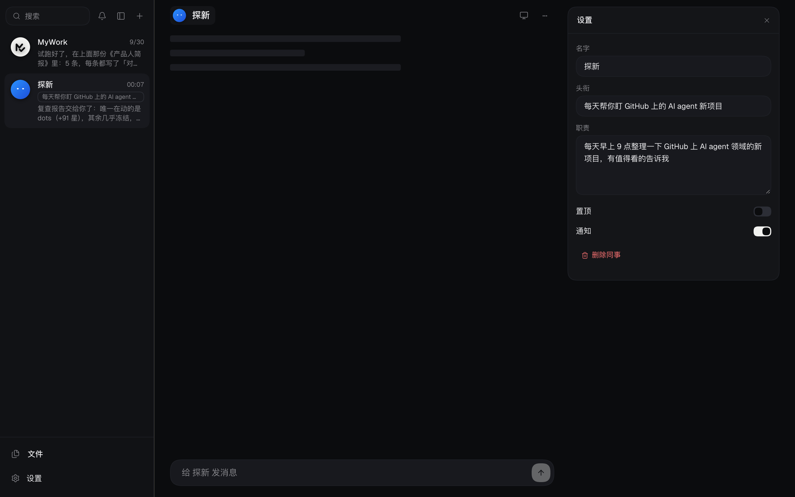
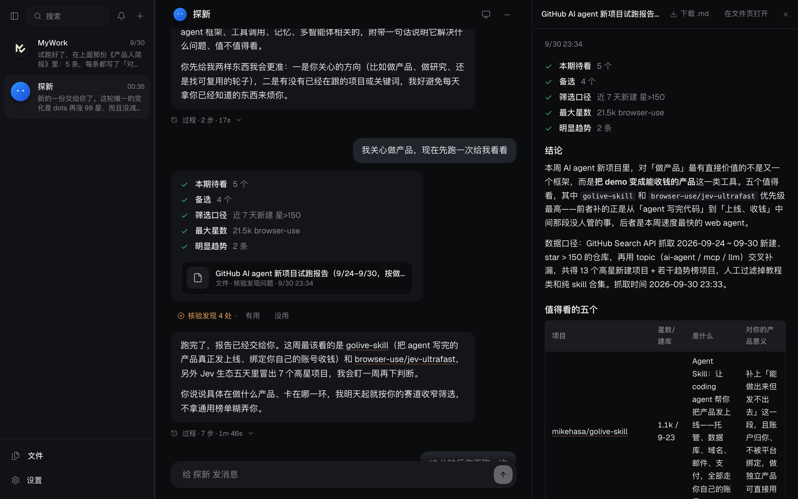

<h1 align="center">MyWork</h1>

<p align="center"><b>AI teammates that live on your computer.</b></p>
<p align="center">Give each ongoing job a teammate: it has a name, one conversation, its own folder and routines, does the work in the background and brings the result back to the same conversation. Your data stays on your computer; your phone connects over the local network.</p>

<p align="center"><a href="README.md">中文</a> · English</p>

<p align="center">
  <a href="https://github.com/deepseek-ai/deepseek-harness"></a>
  
  <a href="LICENSE"></a>
</p>


<p align="center">
  
  
</p>
<p align="center">
  
  
</p>

Full videos: [web: asking 探新 for GitHub hot projects](docs/v2/demo-task.mp4) · [web tour](docs/v2/demo-web.mp4) · [phone: the same job from the phone](docs/v2/demo-phone.mp4)

> This branch, `research-muse-paseo`, is MyWork v2. The first version, MyWork Kit (a dsh plugin bundle: live browser, sheets and slides, IM assistant), is on `main`.

## Why

Most AI products are one-off chats: ask, answer, close. Real work isn't like that. The morning industry news, the Friday weekly report, the competitor prices you keep watching are **ongoing jobs**. Someone has to remember the context, do it on time, hand you the result, and come back only when there's a real question.

MyWork turns AI into **teammates**, not a chat box:

- **One teammate owns one ongoing job.** A news reporter that briefs you three times a day, a scout that checks new GitHub projects every morning, and MyWork for anything else.
- **One teammate, one conversation.** It remembers your preferences; "make it shorter" changes the thing it just made.
- **It works in the background and the result comes back to the conversation**, as a file with checkable key numbers, verified independently by a second session.
- **It interrupts you only when it must**: missing key information, a decision only you can make, a consequential action (paying, sending, deleting), or a password, code or scan.
- **Your data stays on your computer.** No account, no cloud; the phone pairs with this computer by QR.

The product logic follows [Rakazo](https://github.com/elie222/rakazo) (persistent AI teammates rather than disposable chats). It runs on [DeepSeek Harness](https://github.com/deepseek-ai/deepseek-harness) (dsh), built entirely as plugins without modifying dsh.

## Features

### 1. Teammates

| Feature | What it does |
| --- | --- |
| Create in one sentence | "+" at the top left; describe its job, the name is optional. It names and introduces itself and says what it needs from you; a sentence with a time also creates the routine. |
| Identity | Name, title, job description (its standing instructions), a coloured avatar that moves while it works. |
| Default teammate | MyWork is always there, can't be deleted, takes anything. |
| Its own computer | A private folder per teammate as working directory and write boundary; the local real Chrome when it needs the web. |
| Memory | Stable preferences go into `AGENTS.md` in its folder and are read every turn; you can also say "remember …". |
| Settings | Right panel: name, title, job, pin, notifications, delete. |

### 2. Conversation

| Feature | What it does |
| --- | --- |
| One continuous conversation | Backed by one persistent dsh session per teammate with automatic context compaction; the visible history stays complete. |
| Working | The avatar moves and one line reads "working · step · time"; tool calls stay in each turn's folded "process". |
| Results | One bubble per turn: the reply, ✓ checkable key numbers, a file card. |
| Steering | A message sent while it works steers the current job instead of starting another. |
| Stop | A stop button beside the input. |
| Asking you | Only in the four cases above. The question card offers choices, allow/deny, or a free reply; the same session continues. At most twice per turn; routine runs never ask. |
| History | Scroll up for earlier turns; old and migrated turns fold into one line each. |

### 3. Files and verification

| Feature | What it does |
| --- | --- |
| Delivery | Reports, tables and briefs delivered as files with 2–6 key numbers. |
| Reading | A file card opens the full document in the right panel; tables scroll; download as `.md`. |
| Verification | A second read-only session checks each delivery against the material and tool records and flags promises not kept: "verified · 14 checked" or "3 issues found". What you said later ("draft only, don't send") counts as part of the requirement. |
| Rating | Useful / not useful on every file. |
| Files page | Everything every teammate delivered, filterable by teammate and searchable; jumps back to the message that produced it. |

### 4. Routines

| Feature | What it does |
| --- | --- |
| What | A sentence sent to a teammate on a schedule. It belongs to that teammate and its results land in that conversation. |
| Create | Say it with a time ("write the daily report at 7 every evening") and a centred line "scheduled · daily 19:00" appears; or add one in the right panel. |
| On time | A centred line "Daily report · 19:00", then the teammate works as usual. |
| Quiet | Watch routines with no change post nothing and only log the run; reports always arrive. |
| Reminders | Things only you can do just remind you; no teammate work. |
| Daily / weekly reports | Written from all teammates' conversations, deliveries and verifications of the period. |
| Manage | Right panel: edit the sentence and schedule, run now, pause, delete, the last 10 runs (each jumps to its result). |

### 5. Sidebar and navigation

| Area | Content |
| --- | --- |
| Top | Collapse · search (teammates, messages, files, routines) · bell (needs you / working / just finished) · new teammate |
| Middle | Teammates only. Pinned first (MyWork by default), then by most recent conversation; state never reorders. Each row: avatar, name, time, unread dot, latest line (the step while working, the question while waiting). |
| Bottom | Files · Settings |
| Collapsed | A column of avatars (unread dot, pulse while working), new teammate, files |
| Right panel | Click the name or the monitor button: computer (live picture with take-over while it browses, otherwise its folder), routines, settings; or the file you're reading. |
| One jump rule | Anything that shows a result jumps to that message in that teammate's conversation and highlights it. |

### 6. Phone

| Feature | What it does |
| --- | --- |
| Native app | `apps/mobile`, Expo / React Native; Android builds today, iOS from the same code. |
| Connection | On the computer, Settings › MyWork › Phone, allow phone connections and scan. The phone talks only to this computer's LAN gateway; pairing survives restarts; turning the switch off disconnects. |
| Features | Teammates, activity, conversations (bubbles, file cards, question cards, stop), full-screen file reading and sharing, teammate page (routines, settings), new teammate, files. |

### 7. Notifications

| Feature | What it does |
| --- | --- |
| In app | Results and questions pop up, except for the teammate you're looking at. |
| IM | Feishu, DingTalk, WeCom, WeChat and others; only reminders, questions, changed routines, failures and long jobs; per-teammate switch. |

## Getting started

Node ≥ 24, pnpm and a DeepSeek API key.

```bash
git clone -b research-muse-paseo https://github.com/William2333ZZ/mywork-deepseekharness.git
cd mywork-deepseekharness
bash scripts/dev-env.sh
```

The script installs dsh into `.dsh-dev-home/` inside the repo and starts it, leaving `~/.dsh` alone. Open the printed address, add your API key in Settings › Model, then click "+" to create your first teammate.

Phone: in `apps/mobile`, build an APK with `npx eas-cli build --platform android --profile preview`, or run `npx expo run:android`.

## How it's built

| Package | Role |
| --- | --- |
| `packages/tasks` | The teammate engine: one persistent dsh session per teammate, runs, delivery and second-session verification, asking, routine scheduling, memory, files, the API, and the web conversation, right panel and files page |
| `packages/codex-ui` | Sidebar (teammates, bell, search) and settings shell |
| `packages/browser` | The local real Chrome, live picture and take-over |
| `packages/kit` | Bundle and settings entry, phone LAN gateway and pairing |
| `packages/im` | IM notifications |
| `packages/shell` · `schedule` · `mcp` | Themes and fonts, reminders, MCP connectors |
| `apps/mobile` | Phone app |
| `apps/desktop` | Desktop shell (Electron) |

Design: [design/v2/TEAMMATES.md](design/v2/TEAMMATES.md) §9 (teammate model and API contract), [design/v2/MOBILE.md](design/v2/MOBILE.md) (phone).

## Data and privacy

- Everything lives in `$DSH_HOME` (`.dsh-dev-home/home` in development): teammates in `mywork/mates.json`, each teammate's folder in `mywork/mates/<id>/`, runs, deliveries, routines and read state in `mywork/*.json`, session logs in `sessions/`.
- The API key and logins are there too; copy the directory to move machines (it holds the key in plain text).
- The web app listens on this machine only. Phone access must be switched on at the computer; the gateway accepts only the pairing token, and dsh's login token never leaves the computer.

## Status and known limits

- Preview on dsh 0.1.6-alpha.2; newer dsh breaks the sidebar, so the version is pinned.
- A teammate does one thing at a time; hand parallel work to another teammate.
- Teammates share one local Chrome; simultaneous browsing shares tabs.
- The phone works on the same Wi‑Fi only; no push relay, so IM covers you when you're away.
- The desktop installers in Releases are still the first version, MyWork Kit.

## License

This repo's packages are MIT; `packages/codex-ui` is forked from [@michengai/dsh-codex-ui](https://github.com/MichengAI/dsh-codex-ui) and stays Apache-2.0. dsh is the work of [deepseek-ai/deepseek-harness](https://github.com/deepseek-ai/deepseek-harness); this repo is not affiliated with DeepSeek.
