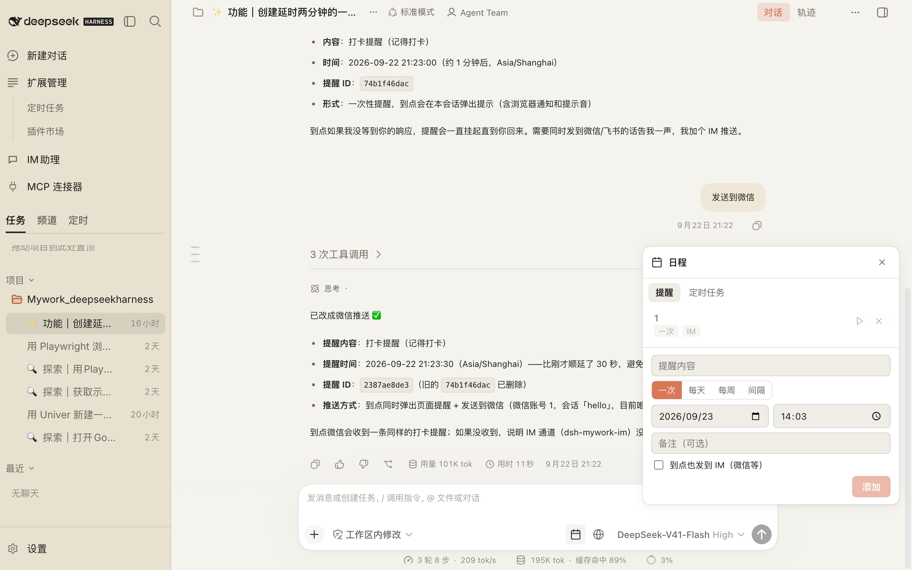
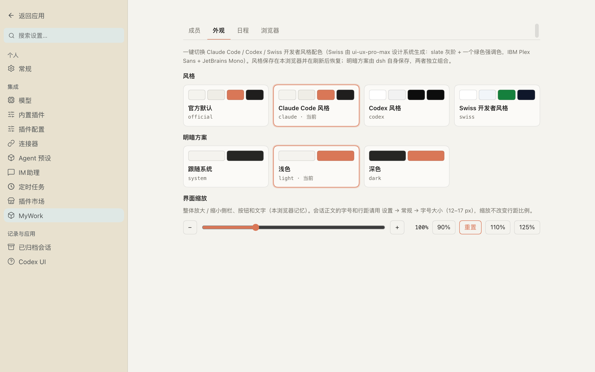
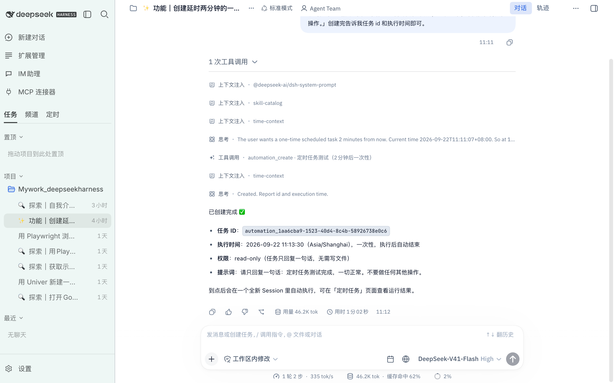
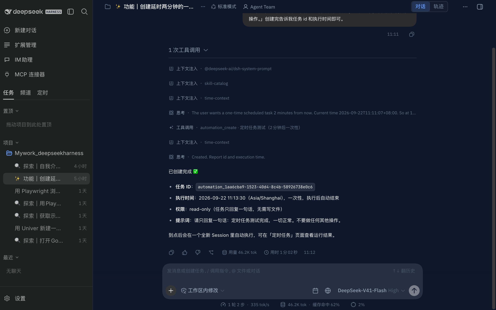

# MyWork Kit for DeepSeek Harness

[DeepSeek Harness（dsh）](https://github.com/deepseek-ai/deepseek-harness) 的个人定制组合包：
**不改 dsh 本体，一切皆插件**。装一个包，带上一套"像 Claude Code / Codex 一样"的工作台，外加
日程（提醒 + 定时任务）、真实浏览器（Chrome 式地址栏、画面随面板铺满）、Univer 表格 / 演示文稿、微信 / 飞书助理、MCP 连接器、Markdown 增强和插件市场。**全程没有 iframe。** 当前版本 **0.2.0**（2026-09-22），更新内容见文末。

```bash
git clone https://github.com/William2333ZZ/mywork-deepseekharness.git
cd mywork-deepseekharness
bash scripts/install.sh web      # 构建并装进你的 dsh web profile（需要 Node ≥ 24、pnpm、dsh）
dsh web
```

## 长什么样


| | |
| --- | --- |
|  **Codex 风格侧栏**：新建对话、扩展管理（定时任务 / 插件市场）、IM助理、MCP 连接器，只显示装了的功能；新建对话页的四个起点是 上网查资料 / 做表格和演示文稿 / 定时任务与提醒 / 微信·飞书助理 |  **实时浏览器**：模型用 Playwright 打开的页面实时出现在右侧栏，能点、能滚、能输入，画面随面板大小铺满，任何会话都能用；地址栏和 Chrome 一样：输网址直接开、输文字就搜索、历史 / 书签建议和行内补全，Ctrl/Cmd+L 聚焦 |
|  **日程面板**：提醒（一次 / 每天 / 每周 / 间隔，到点弹窗 + 通知 + 提示音）与定时任务 |  **定时任务独立页面**：按计划在独立会话里跑编码任务（Automation）；每个任务的设定里有「运行结束发到 IM」 |
|  **IM助理**：微信 / 飞书 / 钉钉 / 企业微信 / QQ / Telegram 接到本机 dsh |  **MCP 连接器**：应用内添加 / 编辑 / 停用 MCP 服务器，粘贴 mcpServers JSON 导入，保存即挂载 |
|  **设置 → MyWork → 成员**：看每个成员的状态，一键补装 / 更新 |  **外观**：Claude Code / Codex / Swiss 开发者 主题 × 浅色 / 深色 / 跟随系统，界面缩放 |
|  **新建对话的四个起点**：上网查资料 / 做表格和演示文稿 / 定时任务与提醒 / 微信·飞书助理，点开就是一条能直接发的提示 |  **Chrome 式地址栏**：输网址直接开、输文字就搜索、历史和书签建议、行内补全、Ctrl/Cmd+L；画面随面板大小铺满 |
|  **表格和演示文稿（Univer）**：模型在实时窗口里边做边看，审阅卡片可全屏、可导出 .xlsx / .pptx |  **定时任务里的 IM 通知**：每个任务自己的设定里选"运行结束发到哪个聊天"（每次 / 仅失败） |
|  **Swiss 开发者风格（浅色）**：用 [ui-ux-pro-max](https://github.com/nextlevelbuilder/ui-ux-pro-max-skill) 生成的设计系统：Minimalism & Swiss，slate 灰阶 + 一个绿色强调色，IBM Plex Sans + JetBrains Mono，规则见 [design-system/mywork-kit/MASTER.md](design-system/mywork-kit/MASTER.md) |  **Swiss 开发者风格（深色）**：同一套 token 的深色版（"Developer Tool / IDE" 配色），对比度 ≥ 4.5:1，焦点环 2 px，200 ms 悬停过渡，尊重 prefers-reduced-motion |

## 这个仓库里有什么

| 目录 | npm 包名 | 作用 |
| --- | --- | --- |
| `packages/kit` | `dsh-mywork-kit` | **组合包本体**：成员清单 `kit.json`；设置页只占一个入口 **MyWork**，里面是标签页（成员 / 外观 / 日程 / 浏览器，各成员通过 `mywork.settings.tab` 槽贡献）；`mywork_kit_status` 工具；同时启用 dsh 自带的会话内提醒（`schedule_*`） |
| `packages/codex-ui` | `dsh-mywork-codex-ui` | **Codex 风格侧栏与设置页**：fork 自 [@michengai/dsh-codex-ui](https://github.com/MichengAI/dsh-codex-ui)（Apache-2.0）。导航按已安装功能收拾：「扩展管理」只放 定时任务（独立主区域页面，不是设置分区）与 插件市场；专家 / 技能 / IM助理 只在对应插件真的注册了设置分区时才出现，不再跳到关于页；去掉了上游两处 iframe 页面 |
| `packages/shell` | `dsh-mywork-shell` | **主题与缩放**：Claude Code / Codex 两套风格 × 浅色/深色/跟随系统，界面缩放 80–150%；MyWork → 外观 |
| `packages/schedule` | `dsh-mywork-schedule` | **日程**：输入框旁的日程面板——提醒（一次性 / 每天 / 每周 / 间隔，到点页面弹窗 + 浏览器通知 + 提示音；`/remind` 与 `reminder_*` 工具）与定时任务（Automation 入口）两个标签；MyWork → 日程 |
| `packages/mcp` | `dsh-mywork-mcp` | **MCP 服务器配置**：侧栏「MCP 连接器」页面里添加 / 编辑 / 停用 stdio 或 streamable-http 服务器、导入 mcpServers JSON；通过 dsh loader 动态挂成官方 mcp-client 条目，保存即生效 |
| `packages/im` | `dsh-mywork-im` | **主动发消息到 IM**：`im_send` / `im_chats` 工具、`/imsend` 命令、IM助理 页里的发送卡片；内容作为转发指令进入聊天对应的会话，由 IM 插件送达微信 / 飞书等。定时任务结束时让模型调用 `im_send` 即可通知到手机；提醒可勾选"到点也发到 IM" |
| `packages/browser` | `dsh-mywork-browser` | **真实浏览器（browser-use）**：后台拉起本机 Chrome（无头），模型经 dsh 官方 `browser-use` + Playwright MCP 驱动它；右侧栏「实时浏览器」标签实时渲染画面、可接管，模型一导航就自动展示；地址栏书签、`open_url` / `quick_links` 工具、`/open` 命令；MyWork → 浏览器 |

其余能力直接复用社区 awesome 插件（都是 npm 上的成熟包，由 kit 面板一键安装）：

| 成员 | 作用 |
| --- | --- |
| [`@michengai/dsh-automation`](https://github.com/MichengAI/dsh-automation) | 定时任务：按计划在独立会话里执行编码任务（一次 / 每小时 / 每天 / 每周 / 每月） |
| [`dsh-mermaid-render`](https://github.com/baosfeng/my-dsh-plugins/tree/main/plugins/dsh-mermaid-render) | 对话中的 mermaid 代码块渲染成图表，离线可用 |
| [`@michengai/dsh-im-connect`](https://github.com/MichengAI/dsh-im-connect) | IM助理：钉钉 / 飞书 / Lark / 微信 / 企业微信 / QQ / Telegram 接到本机 dsh，在聊天里派任务、批准工具；侧栏「IM助理」页配置账号 |
| [`dsh-univer-office`](https://github.com/dream-num/dsh-univer-office) | Univer 办公：让模型创建 / 编辑表格、文档、幻灯片，对话里实时预览、会话结束时审阅再应用；自带 Gateway（9080 起）与查看器，需要本机 Chrome |
| [`dshmarket`](https://github.com/dsh-market/dsh-market) | 设置页内的插件市场：2300+ 社区插件一键装 |

Markdown 渲染本身是 dsh Web 内置能力（`ui-renderer` + 右侧栏文档预览），kit 只补充 Mermaid 与 Codex 排版。

## 安装

前置：Node ≥ 24（见下方"坑"）、pnpm、`dsh` 在 PATH 上。**请装最新的 dsh**：`npm i -g @deepseek-ai/dsh@alpha`（当前 0.1.6-alpha.2，与源码 master 同步；`latest` 标签还停在 0.1.5-rc.2）。本仓库在 0.1.6-alpha.2 与 0.1.5-rc.2 上都验证过。

### A. 一条命令跑起来（推荐先这样试，不碰 `~/.dsh`）

先 `git clone https://github.com/William2333ZZ/mywork-deepseekharness.git && cd mywork-deepseekharness`。

```bash
bash scripts/dev-env.sh           # 在仓库内 .dsh-dev-home/ 装 dsh@alpha + 全部插件与社区成员，起 web 服务（:3090）
bash scripts/dev-env.sh restart   # 改了插件代码后重建并重启
bash scripts/dev-env.sh stop
```

打开命令打印的带 token 的地址；API key 在 设置 → 模型 里填，或运行前 `export DEEPSEEK_API_KEY=…`。Node 低于 24 时脚本会自动改用 Homebrew 的 `node@24`。

### A2. 装进你自己的 dsh（`~/.dsh`）

```bash
npm i -g @deepseek-ai/dsh@alpha pnpm
bash scripts/install.sh web       # 构建本地插件，link 进 web profile，并安装社区成员
dsh web
```

### B. 给其他人用

仓库里已提交各包构建好的 `lib/`，别人只需 clone 后跑 `bash scripts/install.sh web`（A2 的流程）。社区成员从 npm 安装。如果以后把 `packages/*` 发布到 npm，则一行 `dsh plugin --profile web add dsh-mywork-kit` 即可，再到 设置 → MyWork → 成员 一键补装。

然后打开 **设置 → MyWork Kit**，点「补装缺失的 N 个」，重启 dsh 即可。

卸载：`bash scripts/uninstall.sh web`，或逐个 `dsh plugin --profile web remove <name>`。

## 演示案例

下面每个案例都是在这套件里跑通过的。提示词可以原样贴进输入框，或者在「新建对话」页点对应的起点卡片，它会把提示填好，你只要补上具体内容。

### 1. 上网查资料，边看边总结

1. 点输入框旁的地球图标打开右侧「实时浏览器」，地址栏输入 `github.com`（或直接输入一个问题，会用 Bing 搜索），Enter。
2. 对模型说：**打开这个网址给我看，并把页面要点整理成 5 条：https://github.com/deepseek-ai/deepseek-harness**
3. 模型用 Playwright 打开页面，右侧画面实时跟着走，你可以随时自己点、滚、输入；总结出现在对话里。

地址栏和 Chrome 一样：历史 / 书签建议、行内补全（输 `git` 会补成 `github.com`）、↑↓ 选、Esc 还原、在画面里按 Ctrl/Cmd+L 跳回地址栏；搜索引擎在 设置 → MyWork → 浏览器 里换（Bing / Google / 百度 / DuckDuckGo）。


### 2. 做一份演示文稿（或表格）

对模型说：**根据下面的资料做一份演示文稿，5 页以内，每页一个要点，做完截图给我看：**（把资料贴在后面）。

模型会用 Univer 新建 `.univer` 文件，在可拖动的实时窗口里边做边校验（版式检查、截图自查），完成后会话里留一张审阅卡片，可全屏查看、对比版本、导出 `.pptx`。表格同理：**用 Univer 新建一个电子表格：做好表头、示例数据和汇总公式，最后导出 .xlsx。内容是：…**


### 3. 定时任务跑完发到微信

1. 侧栏 扩展管理 → 定时任务 → 新建定时任务：名称、计划时间、任务指令照常填，最下面多了一栏「运行结束发到 IM」，选一个聊天，选 每次结束 / 仅失败，保存。
2. 或者直接说：**创建一个定时任务：每天 09:00 检查 GitHub 上我关注的仓库有没有新 release，跑完把结果发到微信。** 模型会调用 `automation_create` 和 `automation_notify_set`。
3. 到点后任务在独立会话里执行，最后一条回复带着任务名和「完成 / 失败」发到你选的聊天。任务卡片上会显示当前的通知设置。

> 微信个人号机器人只能在你给它发过消息后的一段时间内回复（平台限制，见「已知的坑」）。要准点推送，把通知目标选成飞书 / 钉钉 / 企业微信账号。


### 4. 在微信里直接用助理

1. 侧栏 IM助理 → 添加微信账号（扫码）；飞书 / 钉钉 / 企业微信 / QQ / Telegram 填 Bot 凭证。
2. 在微信里对机器人说话，就是在和本机 dsh 的一个会话对话：**每天 9 点把 ~/Downloads 里超过 30 天的文件列出来发给我** 这种话它会直接建成定时任务。
3. 从桌面这边主动发：IM助理 页顶部的「主动发消息到频道」卡片，或对模型说 **把上面的结论整理成 3 句话，发到微信**，或 `/imsend 内容`。提醒也可以到点顺带发到 IM（新建提醒时勾选）。


### 5. 换个风格、缩放界面

设置 → MyWork → 外观：Claude Code / Codex / Swiss 开发者 三种风格 × 浅色 / 深色 / 跟随系统，侧栏、设置页、气泡、输入框、按钮都跟着换；界面缩放 80–150%，所有弹层、拖动、Univer 窗口、实时浏览器在任何缩放下都对得上鼠标。

| 浅色 | 深色 |
| --- | --- |
|  |  |

## 用法速查

- **主题**：设置 → MyWork → 外观 → 选「Claude Code 风格」「Codex 风格」或「Swiss 开发者风格」，再选浅色/深色/跟随系统。
- **字号**：会话正文字号在 设置 → 常规 → 字号大小（dsh 自带，12–17 px）；整体界面缩放（侧栏、按钮、文字一起放大，80%–150%）在 设置 → MyWork → 外观 → 界面缩放。
- **提醒**：输入框右侧日历图标 → 提醒 → 添加；或对模型说"10 分钟后提醒我看 CI"；或输入
  `/remind 10m 喝水`、`/remind 18:30 下班`、`/remind daily 09:00 站会`、`/remind weekly 1,3,5 10:00 周会`、`/remind every 30m 起身`、`/remind list`。
  到点时页面弹窗 + 浏览器通知（首次在 设置 → MyWork → 日程 里点"申请"授权）+ 提示音。**需保持 DSH 页面开着**（浏览器里没有后台服务）。
- **会话内提醒**（dsh 自带，kit 已启用）：对模型说"30 分钟后提醒我"，模型用 `schedule_create` 记录，到点在同一会话里作为一条 follow-up 消息回来。
- **IM助理**：侧栏「IM助理」独立页面里给微信 / 飞书 / 钉钉等添加账号（扫码或 Bot 凭证），之后在 IM 里直接给本机 dsh 派任务；会话出现在侧栏「频道」标签。
- **主动发到 IM**：IM助理 页顶部的「主动发消息到频道」卡片；对话里说"把结果发到微信"（模型调用 `im_send`）；`/imsend 内容`。定时任务：在任务的设定（新建 / 编辑定时任务 弹窗）里有「运行结束发到 IM」一栏，选聊天和 每次结束 / 仅失败，随任务一起保存，卡片上会显示；或在对话里说"这个任务完成后发到微信"；想让模型自己决定发什么，也可以在描述里让它调用 `im_send`。从微信里也能创建定时任务（直接对机器人说"每天 9 点…"，它会调用 Automation 的 automation_create）。提醒：新建时勾选"到点也发到 IM"。只能发给已经和机器人聊过的聊天，送达经过一次模型回合（几秒）。多个账号 / 聊天时必须指明目标（页面里选，模型用 `im_chats` 看列表），不会猜。
- **MCP 连接器**：侧栏「MCP 连接器」独立页面：添加 / 编辑 / 停用 MCP 服务器（stdio 命令或 streamable-http URL，环境变量 / 请求头），或粘贴 mcpServers JSON 导入；保存即挂载，所有会话可用。页面下方是当前会话实际可用的连接器与工具。
- **定时任务**：侧栏 扩展管理 → 定时任务 打开独立页面（主区域，侧栏仍在；内容来自 Automation）；日程面板 → 定时任务 标签、侧栏「定时」列表里的任务也都跳到这个页面；或直接在对话里描述"每天 9 点跑一遍测试并汇报"。
- **打开网页**：实时浏览器地址栏的书签按钮（Alt/⌥ 点击 = 系统浏览器）；`/open https://…` 或 `/open <书签名>`；或让模型调用 `open_url`。书签在 设置 → MyWork → 浏览器 里维护。一律走后台真实 Chrome，没有 iframe。
- **实时浏览器**：输入框旁的地球图标打开右侧栏「实时浏览器」：后台 Chrome 的实时画面，能点、能滚、能输入。模型每次导航都会自动把这个标签推到前台（CDP 目标事件 → SSE，不轮询）。它接管了 dsh 自带的「浏览器」标签类型，并禁用了 dsh 内置的 iframe 浏览器行。
- **Mermaid**：安装 `dsh-mermaid-render` 后，回复里的 ```mermaid 代码块自动变图。

## 桌面版（免安装的 Windows / Mac 包）

`apps/desktop/` 把 dsh + 全部插件打成自包含的桌面应用：Electron 窗口壳 + 自带 Node 24 + 自带 dsh + 自带 Chrome for Testing + 预装好的 profile。不改 dsh 本体（dsh 作为子进程运行，窗口只加载它的地址）。

```bash
node apps/desktop/build.mjs win-x64     # → apps/desktop/dist/MyWork-DSH-win-x64.zip（解压，双击 MyWork DSH.exe）
node apps/desktop/build.mjs mac-arm64 && bash apps/desktop/package-mac.sh   # → .dmg
```

Windows 包在 Mac 上交叉构建（npm `--os/--cpu` + pnpm `supportedArchitectures` 取目标平台的原生依赖）。未签名：首次运行要过一次 SmartScreen / Gatekeeper。详见 `apps/desktop/README.md`。

## 设计说明（为什么这样做）

- **组合包 = `dsh.bundle` + `cordis.patch.yml`**。dsh 只激活 profile *直接依赖*的组合包层，所以 kit 不是把成员写进 `dependencies`，而是把它们**作为一等公民装进 profile**（面板里的"安装"就是在 profile 目录里跑 `pnpm add` 再回填 `dsh.profile.bundles`，和 `dsh plugin add` 的对账逻辑一致）。好处：任何成员都能单独 `remove`，也能被 dsh-market 管理。
- **宿主插件零依赖**。第三方插件 import `@deepseek-ai/dsh-tools` 在 `link:` 安装时解析不到（checkout 在 profile 目录之外），所以本仓库的宿主代码直接注册原生 JSON Schema 工具定义、手写 Standard Schema 配置（`src/harness.js`），npm / tarball / git / link 四种安装方式都能加载。
- **浏览器半身是 C6 bundle**：`scripts/build-client.mjs` 把纯 CommonJS 的 `src/client/index.js` 包成 `window.__ModuleLoader__.load({ id, factory })`，`react` 由 dsh 提供，零构建依赖。
- **主题用官方 `ctx.theme.overrideTokens` 叠加层**，明暗方案仍交给 dsh 自己保存；不用 `setTheme(自定义 id)`，那样会被宿主的偏好回填反复重置。
- **监听宿主事件要 `{ global: true }`**：第三方插件的 ctx 不在宿主的过滤范围内，`ctx.on('theme/change', fn, { global: true })` 才收得到。
- **HTTP 路由都经宿主 `connection.requestRejection` 鉴权**（同源 / token），安装接口再加 loopback 限制。

## 目录结构

```
packages/
  kit/         kit.json（成员清单）· src/installer.js（pnpm 安装 + bundles 回填）· src/client（设置面板）
  codex-ui/    fork 自 @michengai/dsh-codex-ui（TypeScript，tsdown 构建）· src/client/settings-sections.ts（导航可用性）
  shell/       src/client（主题叠加层 + 缩放，MyWork → 外观）
  schedule/    src/logic.cjs（纯调度逻辑，宿主与浏览器共用）· src/store.js · src/index.js（工具/命令/API）· src/client（日程面板）
  im/          src/chats.js（读 IM 插件的聊天映射）· src/index.js（im_send / im_chats / /imsend / API）· src/client（IM助理 页里的发送卡片）
  mcp/         src/store.js（记录 + mcpServers 导入解析）· src/index.js（loader 动态条目 + API）· src/client（MCP 连接器页面里的管理器）
  browser/     cordis.patch.yml（挂载官方 browser-use + Playwright MCP）· src/chrome.js · src/cdp.js · src/links.js（书签）· src/index.js（open_url、/open、API）· src/client（实时标签 + 书签菜单 + MyWork → 浏览器）
scripts/
  build-client.mjs   零依赖 C6 bundle 打包器（支持 prelude 内联）
  install.sh / uninstall.sh
```

每个包：`node ../../scripts/build-client.mjs .` 构建（codex-ui 用 `pnpm run build` = tsdown）；`pnpm -r test` 跑测试（schedule 逻辑、kit 安装器）。

## 已知的坑

- **`npx @deepseek-ai/dsh` 在 Node 23 下没有任何输出**：入口用了 `import.meta.main`（Node ≥ 24 才有）。用 Node 24 运行即可（macOS：`brew install node@24`）。
- **npm 的 `latest` 标签落后于源码**：用 `@deepseek-ai/dsh@alpha` 才是 master 上的最新版。
- **浏览器内安装 = 在你机器上跑 pnpm**。远程 / 共享部署请在 profile patch 里把 kit 配成 `allowInstall: false`（面板会改为给出终端命令）。
- **git 安装的社区插件**可能被 pnpm ≥ 10 挡在 `allowBuilds` 之外；面板会把 pnpm 的提示原样显示，按提示改 profile 的 `pnpm-workspace.yaml` 后重试。kit 成员优先选了 npm 上有预构建产物的包。
- `dsh-mywork-codex-ui` 会替换官方侧栏/设置总览（patch 禁用 `ui-sidebar`、`ui-settings-general`、`session-title-llm`），主题只叠 token，二者共存。
- **workspace `pnpm install` 的坑**：dsh alpha 包的 peer 写成 `^0.1.6-alpha.2`，pnpm 自动装 peer 时会把它和别的范围交成不存在的 `>=0.1.6`。根 `package.json` 的 `pnpm.overrides`（`@deepseek-ai/dsh-*@>=0.1.6-alpha.0 <0.2.0 → 0.1.6-alpha.2`）解决了这个问题；升级 dsh 时记得同步改。
- `dsh-univer-office@0.3.2` 的前端在 dsh 0.1.6-alpha.2 上不会激活（list slot 注册缺 `id`，报 `list slot "conversation.chat.turnTail" requires options.id`）。上游已在 main 修复（PR #82）但未发版；kit 的安装器 / `profile-fixups.mjs` 会给已装的 0.3.x 打同样的一行补丁（`COMPAT_PATCHES`），0.3.3 上 npm 后删掉即可。
- `@michengai/dsh-im-connect` 给新账号的默认工作区是 dsh 进程的启动目录（`process.cwd()`），不是已登记工作区时每条 IM 消息都会 `挂载会话失败 … 目标工作区不可用`。kit 的宿主插件启动时和 `profile-fixups.mjs` 安装时会把这种账号改到第一个已登记工作区（`packages/kit/src/im-guard.js`）；详见 [issue #1](https://github.com/William2333ZZ/mywork-deepseekharness/issues/1)。
- `dsh-chat-tidy@0.4` 不再是成员：它按旧版 dsh 的 DOM 写的排版 CSS 在 0.1.6-alpha.2 上和 dsh 自己的 16 px 行距叠加（工具调用 / 回复每行多出 14 px 空隙），还会强制 14 px 正文、让 设置 → 字号大小 失效，折叠逻辑也会报 `reading 'order'`。等它适配新版后可以自己 `dsh plugin --profile web add dsh-chat-tidy`。
- **微信推送有时效**：微信个人号机器人接口只允许在你给它发消息后的一段时间内回复（靠那条消息带的 context_token），过期后所有主动发送都报 `sendmessage ret=-2 prepare failed`。提醒和定时任务通知在这个窗口外会发不出去。对策：给机器人回一句就续期；要准点推送用飞书 / 钉钉 / 企业微信账号做通知目标。
- Kit 的 patch 还关掉了 dsh 会话头部的「Open In…」按钮（访达 / Cursor / 终端），想要回来在 profile patch 里写 `- id: ui-open-in-app` + `disabled: false`（`open-in-app` 同理）。
- **dsh 核心模块只能有一份**：插件不要把 `@deepseek-ai/dsh-*` 写进 `dependencies`（profile 用 hoisted + 不自动装 peer，dsh 启动时把这些 import 指回自己的那份）。真实浏览器依赖的官方 browser-use / Playwright MCP 因此作为 kit 成员装进 profile，而不是打进 `dsh-mywork-browser`。官方的 `dsh-experimental-browser-use-runtime` 自己又把 `dsh-scope` / `dsh-mcp-client` 写成了 dependencies（上游打包问题），会在 profile 里多出第二份 → 新建会话报 `tools.restrict() requires a scoped context`。kit 用 pnpm 的 `"-"` override 把这两个包从 profile 里去掉（`kit.json` 的 `profileOverrides`；安装器、`install.sh`、`dev-env.sh` 都会同步到 profile 的 `package.json`）。
- **每个会话都能用浏览器**：官方 Playwright provider 在 attach 模式下只给启动后第一个会话用（其它会话报 `browser tool belongs to another Session`）。`dsh-mywork-browser` 自己用官方运行时给每个会话挂一份非独占的 Playwright MCP，所以套件的 patch 不插入官方 `browser-use-playwright` 行。多个会话同时操作时共用同一批标签页。
- **本套件的约定：不做 iframe 网页浏览。** `dsh-mywork-browser` 禁用了 dsh 内置的 iframe 浏览器行；不想要这条行为可在 profile patch 里写 `- id: ui-sidebar-browser` + `disabled: false` 恢复。

## 数据文件

- 提醒：`$DSH_HOME/mywork/reminders.json`
- 书签：`$DSH_HOME/mywork/links.json`；Chrome 登录态：`$DSH_HOME/mywork/chrome-profile`
- 主题选择：浏览器 localStorage（`dsh-mywork-shell:theme` / `dsh-mywork-shell:zoom`）；明暗方案由 dsh 写 `$DSH_HOME/settings.yaml`

## 更新记录

### 0.2.0（2026-09-22）

- 定时任务的 IM 通知改到每个任务自己的设定里（新建 / 编辑弹窗多一栏「运行结束发到 IM」，卡片显示当前设置）；保存失败、取消都不会写入。
- 界面缩放重做：缩放作用在应用根节点，dsh 的浮层菜单、悬停卡片、拖动、Univer 窗口、实时浏览器在 80–150% 下全部对齐（[#2](https://github.com/William2333ZZ/mywork-deepseekharness/issues/2) [#6](https://github.com/William2333ZZ/mywork-deepseekharness/issues/6) [#7](https://github.com/William2333ZZ/mywork-deepseekharness/issues/7)）。
- 移除 dsh-chat-tidy（在 alpha.2 上把行距放大一倍、让字号失效，[#4](https://github.com/William2333ZZ/mywork-deepseekharness/issues/4)）；折叠工具调用组上方的空白带修掉（[#3](https://github.com/William2333ZZ/mywork-deepseekharness/issues/3)）。
- 风格切换真正换肤：气泡 / 输入框 / 强调色 / 侧栏 / 设置页都跟着风格走（[#5](https://github.com/William2333ZZ/mywork-deepseekharness/issues/5)）；新增用 ui-ux-pro-max 设计系统生成的「Swiss 开发者风格」（design-system/mywork-kit/MASTER.md）。
- 实时浏览器：Chrome 式地址栏（网址 / 搜索 / 历史 / 书签 / 行内补全 / Ctrl+L），页面视口跟随面板大小，右侧栏引导入口换成和 dsh 一致的图标。
- 新建对话页的起点改成 上网查资料 / 做表格和演示文稿 / 定时任务与提醒 / 微信·飞书助理。
- IM 账号工作区未登记时自动修正（[#1](https://github.com/William2333ZZ/mywork-deepseekharness/issues/1)）。

## License

本仓库的包（kit / shell / schedule / browser / mcp）为 MIT；`packages/codex-ui` fork 自 [@michengai/dsh-codex-ui](https://github.com/MichengAI/dsh-codex-ui)，保持 Apache-2.0（见其 LICENSE / NOTICE）。社区成员各按其自身许可证。
