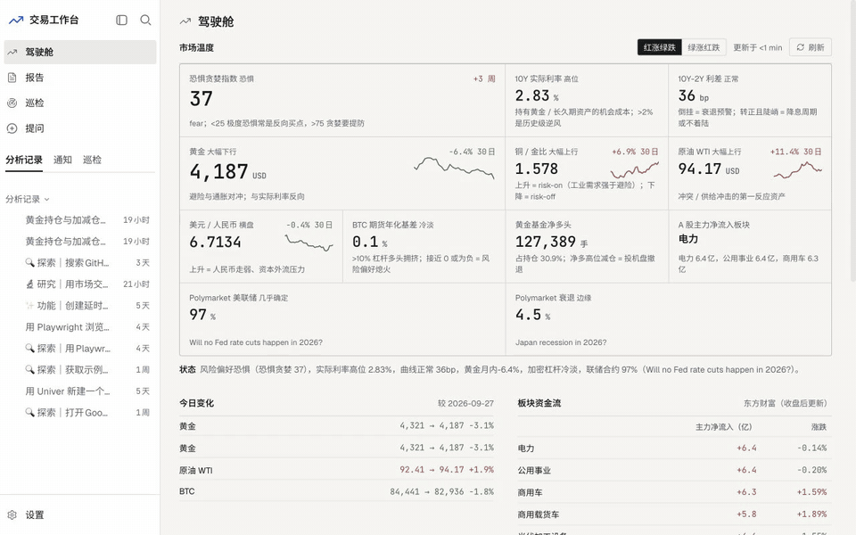
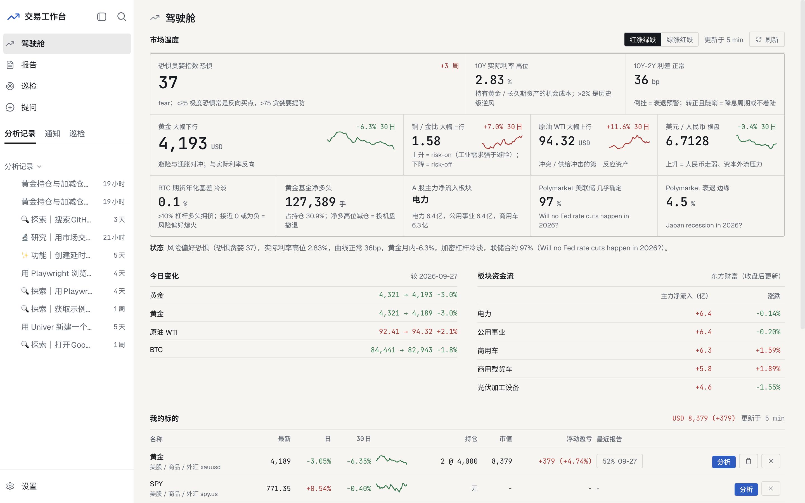
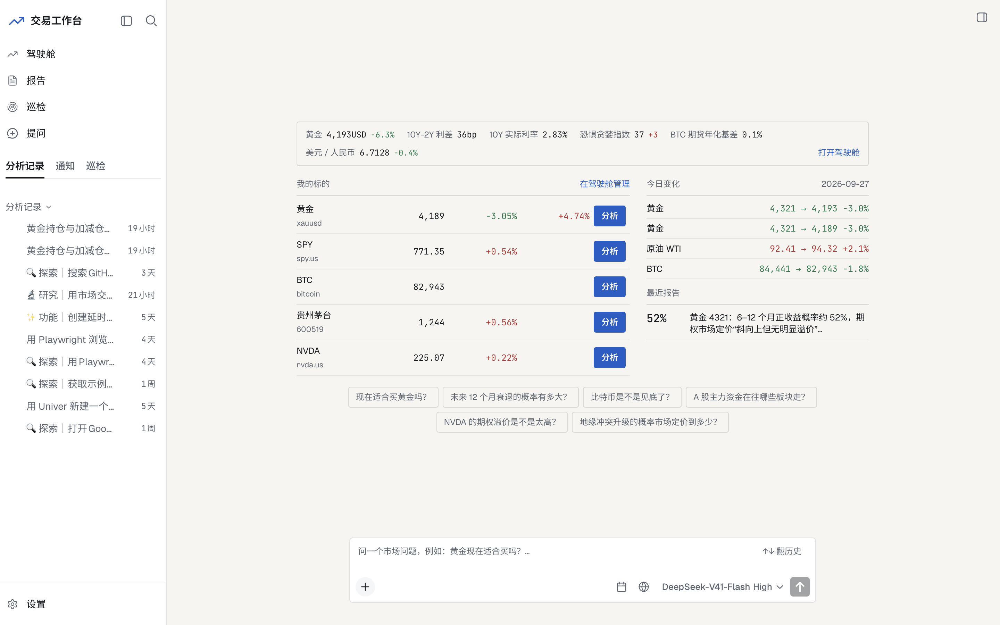
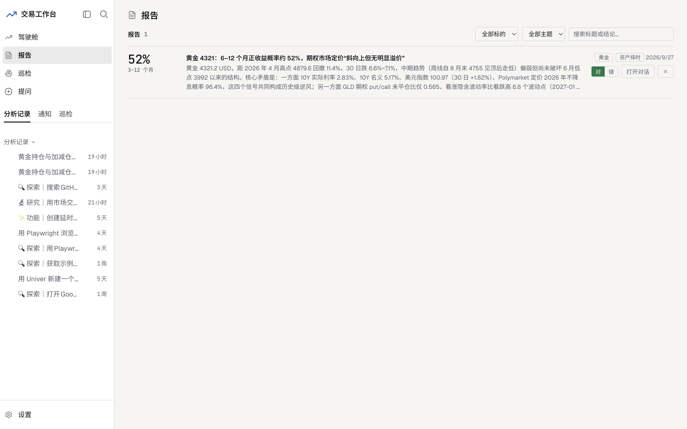
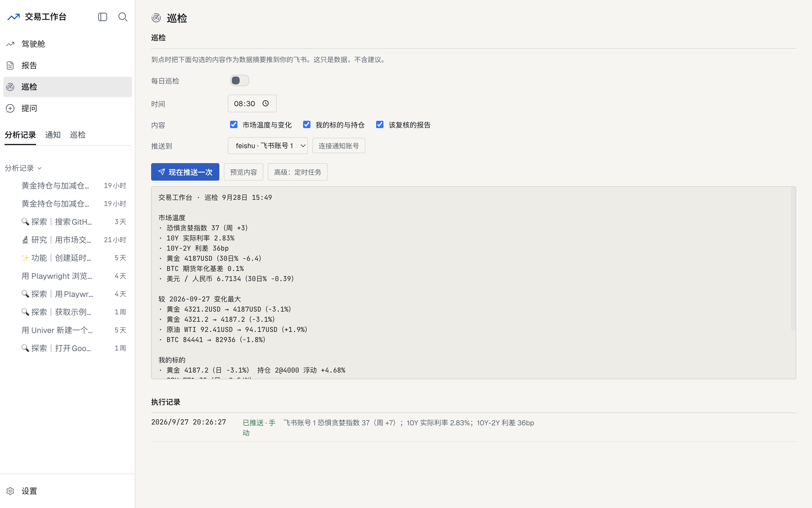
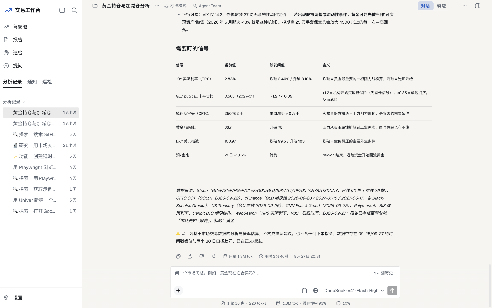
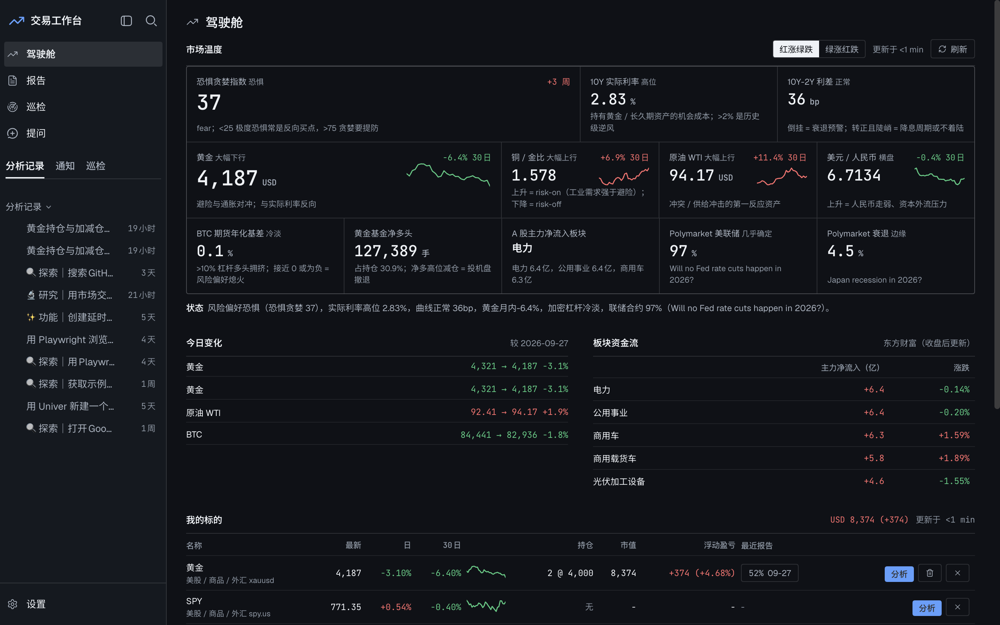

[English](README.en.md) | **中文**

# 交易工作台

一个人的交易分析工作站。用市场交易数据回答「这件事概率多大」「现在值不值得买」「主力在买还是卖」，不看新闻不读观点。看盘、提问、留档、复盘，每天由巡检自动推一次。

它跑在 [DeepSeek Harness](https://github.com/deepseek-ai/dsh) 上，是 [MyWork Kit](docs/mywork-kit-README.md) 的交易发行版：dsh 本体一行不改，一切皆插件。分析引擎是内置的 [Digital Oracle](https://github.com/komako-workshop/digital-oracle)（komako-workshop，MIT）：13 个免费数据源，全部无需 API key。

**只做分析。** 不下单、不接券商或交易所账户、不给个性化投资建议。持仓是你自己填的数量和成本，只用来算盈亏和给模型当背景。



## 一屏看懂

| 驾驶舱 | 提问 |
| --- | --- |
|  |  |

| 报告 | 巡检 |
| --- | --- |
|  |  |

| 分析对话 | 深色 |
| --- | --- |
|  |  |

## 它每天做的四件事

```
看盘 ──▶ 提问 ──▶ 报告 ──▶ 留档 ──▶ 复盘
 ▲                                   │
 └──────────── 巡检（每天自动） ◀────┘
```

### 驾驶舱（首页）

打开就是市场，不是聊天窗口。

- **市场温度**：恐惧贪婪指数、10Y 实际利率、10Y-2Y 利差、黄金、铜/金比、原油、美元/人民币、BTC 期货基差、CFTC 黄金基金净多头、A 股主力净流入板块、Polymarket 美联储与衰退合约。每张卡带 30 日变化、一个状态词（恐惧 / 高位 / 倒挂 / 拥挤…）和一句含义，下面一句规则算出的市场状态。
- **今日变化**：和前一天快照比变动最大的信号，噪声以下的不列。
- **板块资金流**：东方财富主力净流入前五的板块。
- **我的标的**：自选和持仓一张表。美股 / 商品 / 外汇、A 股、加密、Polymarket、Kalshi 五类都能加；有持仓的行显示数量、成本、市值、浮动盈亏；每行一个「分析」，A 股多一个「资金流」；有报告的行显示最近一次的概率和日期。
- **报告档案**：最近三份，全部在报告页。
- 涨跌配色可切：默认红涨绿跌，也可以绿涨红跌；每个变动都带正负号。

### 提问

左栏「提问」是对话入口。输入框上方是驾驶舱要点：行情条、我的标的、今日变化、最近报告；下面一行常见问法。按某个标的的「分析」，工作台会开一个新对话，把这只标的的报价、你的持仓、市场温度和该取哪些数据一起发出去，不用再按发送。

模型按 Digital Oracle 的五步方法工作：理解问题、选信号、并行取数、矛盾推理、结构化输出。至少三个独立维度，报告固定是「分层信号表 → 矛盾分析 → 概率场景（标注时间窗口）→ 信号一致性」，写完自动存档。会话标题就是问题本身。

### 报告

每份报告一行：概率是主数字，标题、结论、标的与主题标签、日期、打开原对话。按标的和主题筛，能搜索。同一标的的多次报告把概率按时间连成历史，这是复盘。右侧「对 / 错」是事后验证。

### 巡检

一个开关、一个时间、三个勾选（市场温度与变化、我的标的与持仓、该复核的报告）、一个飞书账号。到点把纯数据摘要推到你的飞书；可以预览，也可以立刻推一次；有执行记录。两周没标对错的报告会在摘要里提醒。

## 安装与运行

### 开发环境（现在）

需要 Node 24、pnpm、Python 3.9+（macOS 自带即可）。

```bash
git clone -b digital-oracle-work https://github.com/William2333ZZ/mywork-deepseekharness.git
cd mywork-deepseekharness
bash scripts/dev-env.sh start
```

启动后打开 `.dsh-dev-home/web.log` 里 `dsh web:` 后面的带 token 地址。DeepSeek 的 key 按 dsh 自己的方式配置（设置 → 模型），不要写进仓库。

美股价格历史和期权链需要 `yfinance`：设置 → MyWork → 市场先知 里一键安装，或 `uv pip install yfinance`。其余 12 个数据源只用 Python 标准库。

### 桌面版（打包前）

`apps/desktop/` 是 Electron 壳，应用名 TradingWorkbench，窗口标题「交易工作台」，自带 Node、dsh 和 Chrome for Testing，实时浏览器是嵌在窗口里的原生标签页。打包方式见 [apps/desktop/README.md](apps/desktop/README.md)。

## 数据源

| 来源 | 内容 | 用途 |
|------|------|------|
| Polymarket | 预测市场合约 | 事件概率定价 |
| Kalshi | 美国监管的事件合约 | 联储、政治、经济事件 |
| Yahoo Finance | 股票 / ETF / 外汇 / 商品价格 | 价格趋势与相对价格 |
| YFinance 期权链 | 美股期权 | IV、put/call、max pain、Greeks |
| US Treasury | 国债收益率 | 名义曲线、实际利率 |
| CFTC COT | 期货持仓 | 机构方向 |
| SEC EDGAR | 内部人交易 | Form 4 买卖 |
| Deribit | 加密衍生品 | 期货基差、期权 IV |
| CoinGecko | 加密现货 | 价格、市值 |
| BIS | 央行数据 | 政策利率、信贷缺口 |
| World Bank | 发展指标 | GDP、贸易 |
| 东方财富 | A 股行情与资金流 | 拆单资金流、板块轮动、前复权 K 线 |
| CNN Fear & Greed | 情绪指数 | 风险偏好 |
| 网页搜索 | 补充数据 | VIX、CDS 等 |

全部免费、无需 key。驾驶舱的信号 15 分钟刷一次，自选报价 5 分钟；手动刷新有 45 秒冷却。

## 设计

产品设计按 Open Design 的方法立了合约，改界面先改合约：

- [design/PRODUCT.md](design/PRODUCT.md)：产品设计（用户、核心循环、信息架构、每屏线框、分期）
- [design/DESIGN.md](design/DESIGN.md)：视觉规范九节
- [design/design-contract.md](design/design-contract.md)：证据、保留 / 改动、质量门禁
- [docs/DEMO.md](docs/DEMO.md)：演示讲稿

默认风格「市场终端」：中性底色、一个蓝色动作色、语义涨跌色、Geist 配 JetBrains Mono、1px 细线、4px 圆角，浅色深色每个文字角色都过 WCAG AA。另有 Claude Code、柔和高级、极简编辑、工业粗野四种风格。

## 目录

```
packages/oracle/        dsh-mywork-oracle：驾驶舱、报告、巡检、oracle_* 工具、巡检推送
packages/oracle/digital-oracle/   上游 Digital Oracle（git subtree）
packages/codex-ui/      侧栏与页面（发行版模式在 src/edition.ts）
packages/shell/         风格家族（市场终端为默认）
packages/browser|schedule|im|mcp|kit   MyWork Kit 其余成员
apps/desktop/           桌面壳
design/                 设计合约
docs/                   演示、截图、套件原 README
```

## 与 MyWork Kit 的关系

本分支是 MyWork Kit 的交易发行版。`main` 是通用套件，会定期合并进来；本分支不反向合并。发行版差异见 [DISTRIBUTION.md](DISTRIBUTION.md)。套件自己的说明保留在 [docs/mywork-kit-README.md](docs/mywork-kit-README.md)。

## 更新日志

### 未发布

- 交易工作台发行版：驾驶舱（市场温度、状态句、今日变化、板块资金流、我的标的、报告档案）、提问页、报告页（筛选、同题历史、对错）、巡检页（定时飞书摘要）、市场终端风格、涨跌配色、桌面壳改名。
- 内置 Digital Oracle：`oracle_docs` / `oracle_providers` / `oracle_fetch` / `oracle_status` / `oracle_portfolio` / `oracle_report_save` 工具与系统提示。
- 套件本身的更新（字体离线、Claude 桌面式实时浏览器、飞书直推等）见 [docs/mywork-kit-README.md](docs/mywork-kit-README.md)。

## 许可

MIT。内置的 Digital Oracle 为 MIT（komako-workshop）；Open Design 的方法与设计系统包为 Apache-2.0（nexu-io），本仓库只引用其方法，不含其代码。
