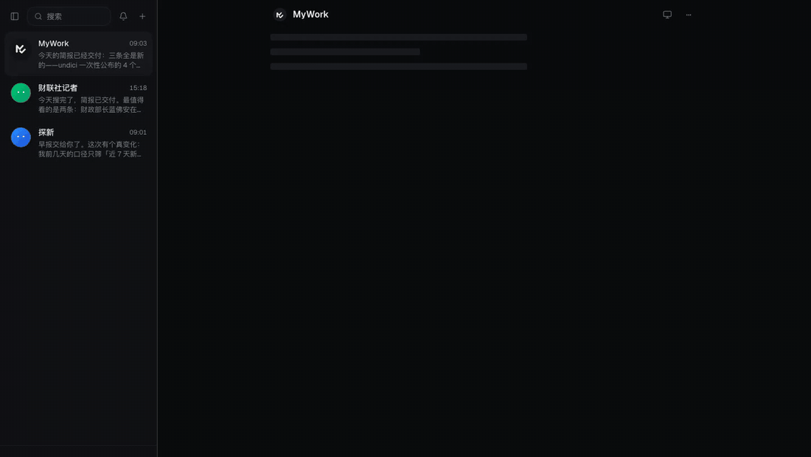
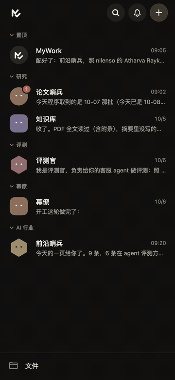
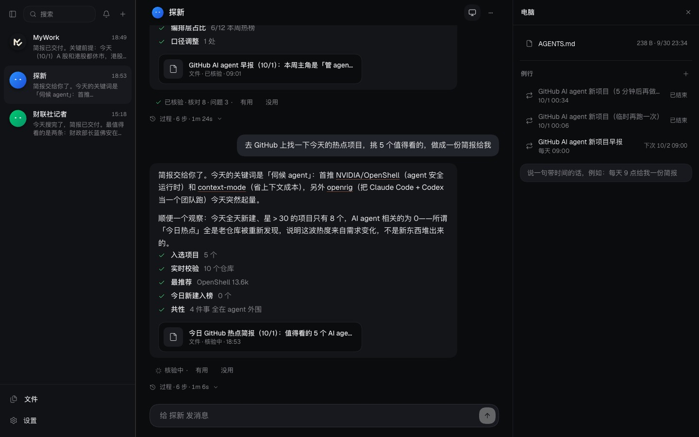
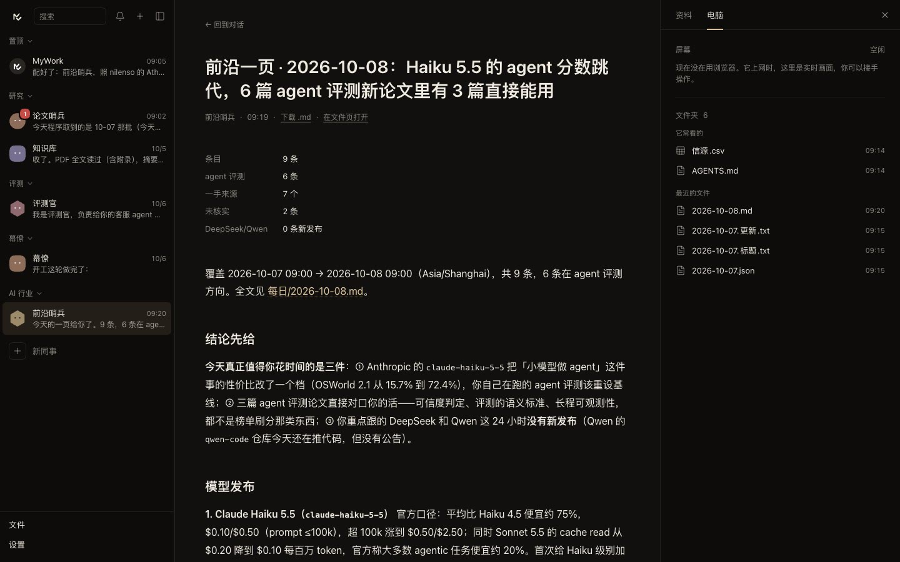
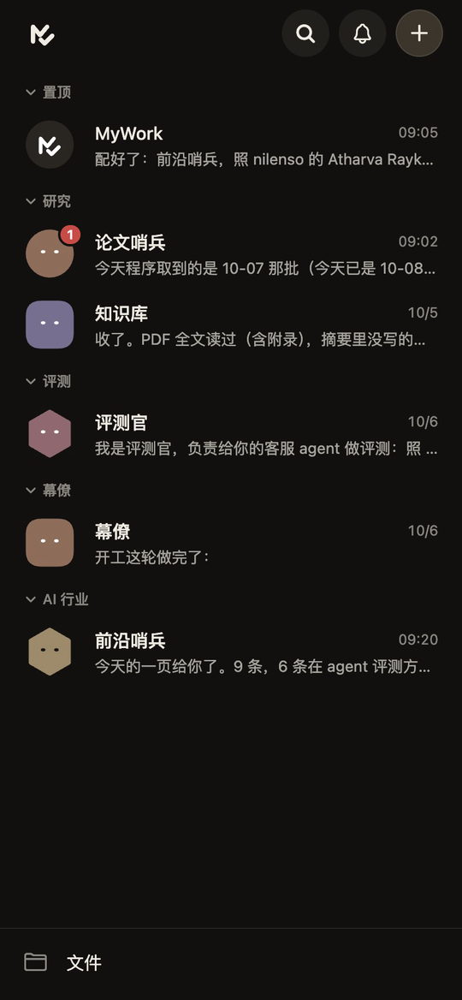
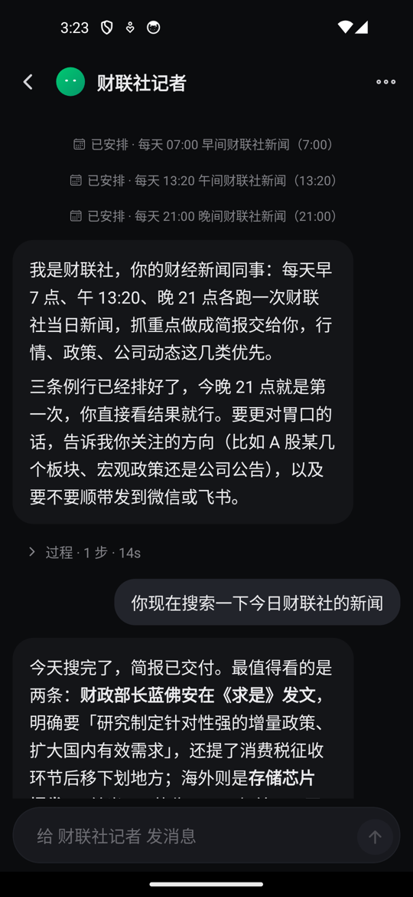

<h1 align="center">MyWork</h1>

<p align="center"><b>住在你电脑里的 AI 同事。</b></p>
<p align="center">给每件长期的事找一位同事：它有名字、有自己的对话、文件夹和例行，在后台把活干完，结果回到同一条对话里。数据都在你自己的电脑上，手机通过局域网连回来。</p>

<p align="center">中文 · <a href="README.en.md">English</a></p>

<p align="center">
  <a href="https://github.com/deepseek-ai/deepseek-harness"></a>
  
  <a href="LICENSE"></a>
</p>

<table>
<tr>
<td width="72%"></td>
<td width="28%"></td>
</tr>
<tr>
<td align="center">网页：让「探新」去 GitHub 找今天的热点（<a href="docs/v2/demo-task.mp4">视频</a>）</td>
<td align="center">手机：同一件事在手机上交代（<a href="docs/v2/demo-phone.mp4">视频</a>）</td>
</tr>
</table>

<p align="center">
  
  
</p>
<p align="center">
  
  
</p>

> 本分支 `research-muse-paseo` 是 MyWork 的第二版。第一版「MyWork Kit」（dsh 插件组合包：实时浏览器、表格演示、IM 助理）在 `main` 分支。

## 立意

大多数 AI 产品是一次性对话：问一句，答一句，关掉就没了。真正的工作不是这样的。每天早上要看的行业新闻、每周五要交的周报、一直在盯的竞品价格，都是**持续的事**：需要有人记得上下文、按时去做、做完把东西交给你，有问题再来问你。

MyWork 把 AI 做成**同事**，而不是聊天框：

- **一位同事负责一件长期的事。** 「财联社记者」每天三次整理新闻，「探新」每天早上盯 GitHub 新项目，「MyWork」什么杂事都能接。
- **一位同事只有一条对话。** 它记得你说过的偏好；追问「再短一点」，改的就是刚才那份，不会每次从零开始。
- **它在后台干活，结果回到对话里。** 你不用盯着；干完的东西是一份文件，附带可核对的要点，并由第二个会话独立核验。
- **它只在真需要你的时候来找你。** 缺关键信息、要你拍板、要付钱发消息删东西、要你登录，才会停下来问。
- **数据在你自己的电脑上。** 没有账号，没有云；手机扫码连这台电脑。

产品逻辑借鉴 [Rakazo](https://github.com/elie222/rakazo)（持续的 AI 队友，而不是一次性的对话）；运行在 [DeepSeek Harness](https://github.com/deepseek-ai/deepseek-harness)（dsh）上，全部以插件实现，不改 dsh 本体。

## 功能拆解

### 1. 同事

| 功能 | 说明 |
| --- | --- |
| 一句话新建 | 左上「+」，写一句「它负责什么」，名字可以不填。它会自己起名、自我介绍，说出需要你补充什么；这句话里带时间，就顺手把例行建好。 |
| 身份 | 名字、头衔、职责（职责就是它的工作指令）、彩色头像（干活时会动）。 |
| 默认同事 | 「MyWork」一直在、不能删，什么都能接。 |
| 自己的电脑 | 每位同事一个独立文件夹，是它的工作目录和写入边界；需要上网时用本机真实 Chrome。 |
| 记忆 | 它把稳定的偏好记进自己文件夹里的 `AGENTS.md`，之后每轮都会读到；你也可以直接说「记住……」。 |
| 资料 | 点名字打开右栏「资料」：资料卡（头像、名字、头衔、类型，点文字直接改）、职责、例行、它记住的、置顶与通知、删除。 |

### 2. 对话

| 功能 | 说明 |
| --- | --- |
| 一条永远的对话 | 每位同事一条对话，背后是一条持续的 dsh 会话；长了自动压缩上下文，界面上的历史完整保留。 |
| 干活中 | 头像在动，对话底部一行「在干活 · 当前步骤 · 用时」；工具调用不刷屏，收在每轮的「过程」里。 |
| 结果 | 一轮一个气泡：回复正文、✓ 可核对的要点（如「电报条数 40 条」「沪指 3842.19」）、文件卡。 |
| 插话 | 它干活时你再说一句，会插进正在做的事里调整方向，不另起一件。 |
| 停止 | 输入框旁的停止键。 |
| 找你 | 只在四种情况停下来问：缺关键信息、要你拍板、有后果的动作、要密码验证码扫码。问题卡可以点选项、允许或拒绝、直接回一句；答完同一会话接着做。每轮最多问两次，例行运行从不问。 |
| 回看 | 向上翻加载更早；旧的、迁移来的记录折成一行（原话 + 文件名），点开再展开。 |

### 3. 文件与核验

| 功能 | 说明 |
| --- | --- |
| 交付 | 同事交出文件（报告、表格、简报），带 2 到 6 行要点。 |
| 阅读 | 点文件卡在右栏打开全文，表格可横滚，可下载 `.md`。 |
| 核验 | 每份交付由第二个只读会话独立核对：要点对不对得上素材和工具记录、有没有承诺了没做的事。结果写在气泡下：「已核验 · 核对 14」或「核验发现 3 处」。你后来补充的话（比如「只写草稿别发送」）也算进要求里。 |
| 评价 | 每份文件「有用 / 没用」。 |
| 文件页 | 左栏底部「文件」：所有同事交过的东西，按同事筛选、可搜索，点开能跳回出这份文件的那条消息。 |

### 4. 例行

| 功能 | 说明 |
| --- | --- |
| 是什么 | 到点替你发给某位同事的一句话。例行属于同事，结果回到这位同事的对话。 |
| 建 | 在对话里说带时间的话（「每天晚上 7 点写日报」），同事确认，对话里出一行「已安排 · 每天 19:00 写日报」；或在右栏例行一栏写一句。 |
| 到点 | 对话里一行「每日日报 · 19:00」，接着同事照常干活，结果是普通回复。 |
| 安静 | 盯变化的例行，没有变化就不出消息、不打扰，只在运行记录里记一笔；日报周报每次都出。 |
| 提醒 | 只有你能做的事（开会、交材料），到点只提醒你，不让同事干活。 |
| 日报 / 周报 | 从所有同事当天、这周的对话、交付和核验结果里写，不靠回忆。 |
| 管理 | 右栏「资料」的例行一栏：改原话和时间、现在跑一次、暂停、删除、最近 10 次运行（点一次跳到那次结果）；跑完的一次性例行收起。 |

### 5. 侧栏与导航

| 区域 | 内容 |
| --- | --- |
| 顶部 | 折叠 · 搜索（同事、消息、文件、例行）· 铃铛（需要你 / 在干活 / 刚完成，点一项跳到那条消息）· 新同事 |
| 中间 | 只有同事，按 置顶 → 类型 → 其他 分区。置顶的在前（MyWork 默认置顶），其余按最近对话时间；状态不改变顺序。一行是头像（右上角红色未读数）、名字、时间和最近一句（在干活时是步骤，等你答时是问题）；列表末尾是「新同事」。 |
| 底部 | 文件 · 设置 |
| 折叠后 | 同一个布局只收起文字：品牌标、每位同事的头像和未读数、分区、新同事、文件、设置都留在原位，不跳动 |
| 右栏 | 两个标签「资料 · 电脑」。资料：它是谁、负责什么、例行和记忆；电脑：它在用浏览器时是实时画面（可接管），以及它的文件夹（它维护的表 + 最近的文件）。 |
| 外观 | 设置 › 场景与成员 › 外观：两套配色，「炭 · 香槟」（默认：暖炭灰与暖象牙，香槟金只给和你有关的——你的消息、等你答的事、能按的按钮、链接）和「墨 · 雾紫」；每套都有深色和浅色，跟着明暗方案（跟随系统 / 浅色 / 深色）走。所有文字对比度达到 WCAG AA。 |
| 跳转规则 | 凡是去看结果，都跳到那位同事对话里的那一条并高亮：铃铛、通知、搜索、例行运行记录、文件页都一样。 |

### 6. 手机

| 功能 | 说明 |
| --- | --- |
| 原生 App | `apps/mobile`，Expo / React Native；Android 已出包，iOS 同一份代码。 |
| 连接 | 电脑上 设置 › 场景与成员 › 手机 打开「允许手机连接」，扫码配对。同一个 Wi‑Fi 时手机直连这台电脑的局域网网关；打开「在外面也能连（加密中继）」后，在 4G 或别的网络下走加密中继（apps/relay，Cloudflare 免费版），中继只转发端到端加密的数据。配对跨重启有效，关掉开关即断。 |
| 功能 | 同事列表、铃铛动态、对话（气泡、文件卡、问题卡、停止）、文件全屏阅读与分享、同事页（例行、设置）、新同事、文件页。 |
| 外观 | 和电脑同一套配色（炭 · 香槟 / 墨 · 雾紫），深浅跟随手机系统，也可以在手机的 设置 里固定；头像用电脑上选的颜色和形状。 |

### 7. 通知与外部渠道

| 功能 | 说明 |
| --- | --- |
| 应用内 | 有结果、需要你时弹出；正在看的那位同事不弹。 |
| IM | 可接飞书、钉钉、企业微信、微信等，只推提醒、问题、有变化的例行、失败和较长的任务；每位同事可以单独关通知。 |

## 开始使用

需要 Node ≥ 24、pnpm 和一个 DeepSeek API key。

```bash
git clone -b research-muse-paseo https://github.com/William2333ZZ/mywork-deepseekharness.git
cd mywork-deepseekharness
bash scripts/dev-env.sh
```

脚本在仓库内的 `.dsh-dev-home/` 装好 dsh 并启动，不碰你的 `~/.dsh`。打开终端里打印的地址，在 设置 › 模型 填 API key，然后点左上「+」新建第一位同事。

手机：在 `apps/mobile` 用 `npx eas-cli build --platform android --profile preview` 出 APK 安装，或本地 `npx expo run:android`。

## 怎么做到的

| 包 | 作用 |
| --- | --- |
| `packages/tasks` | 同事引擎：每位同事一条持续的 dsh 会话、运行记录、交付与第二会话核验、找你、例行调度、记忆、文件、API，以及网页端的对话、右栏和文件页 |
| `packages/codex-ui` | 侧栏（同事、铃铛、搜索）与设置页外壳 |
| `packages/browser` | 本机真实 Chrome，右栏实时画面与接管 |
| `packages/kit` | 组合包与设置入口，手机局域网网关与配对 |
| `packages/im` | IM 通知 |
| `packages/shell` · `schedule` · `mcp` | 主题与字体、提醒、MCP 连接器 |
| `apps/mobile` | 手机 App |
| `apps/desktop` | 桌面壳（Electron） |

设计文档：[design/v2/TEAMMATES.md](design/v2/TEAMMATES.md) §9 是同事模型与 API 契约，[design/v2/MOBILE.md](design/v2/MOBILE.md) 是手机端。

## 数据与隐私

- 所有数据都在 `$DSH_HOME`（开发环境是 `.dsh-dev-home/home`）：同事在 `mywork/mates.json`，每位同事的文件夹在 `mywork/mates/<id>/`，运行记录、交付、例行、已读在 `mywork/*.json`，会话日志在 `sessions/`。
- API key 和登录态也在这里；换机器拷走这个目录即可（含明文 key，注意保管）。
- 网页只监听本机。手机连接要你在电脑上手动打开；网关只认配对令牌，dsh 的登录令牌不离开这台电脑。中继（默认关）只转发加密数据：电脑的 X25519 公钥只在配对码 `#` 后面，中继没有它的私钥，看不到也冒充不了；经过中继只能访问 MyWork 的接口和文件签名链接。

## 现状与已知限制

- 预览版，跑在 dsh 0.1.6-alpha.2 上；更新的 dsh 会让侧栏报错，暂时锁版本。
- 一位同事同一时间只做一件事；想并行就交给另一位同事。
- 同事共用本机一个 Chrome，同一时刻多位同事上网会共用标签页。
- 手机在外面要打开「在外面也能连」；默认中继在 `workers.dev` 上，国内移动网络可能连不上，需要时给中继绑一个自己的域名。在外面时网页 / PDF 还不能交给手机浏览器打开。没有系统推送，人不在电脑旁时靠 IM 提醒。
- Releases 里的桌面安装包还是第一版 MyWork Kit。

## 许可证

本仓库的包为 MIT；`packages/codex-ui` fork 自 [@michengai/dsh-codex-ui](https://github.com/MichengAI/dsh-codex-ui)，保持 Apache-2.0。dsh 是 [deepseek-ai/deepseek-harness](https://github.com/deepseek-ai/deepseek-harness) 的作品，本仓库与 DeepSeek 无隶属关系。
